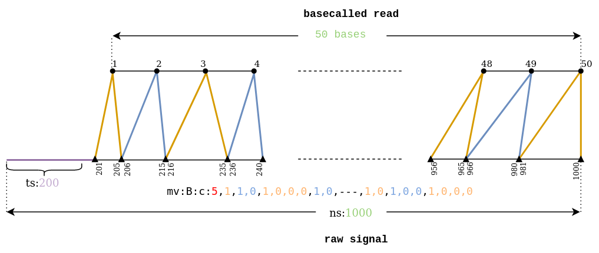

# squigualiser

A simple tool to Visualise nanopore raw signal-base alignment


1. The first read is a signal-read alignment using guppy_v.6.3.7 move table annotation ([link](https://hiruna72.github.io/squigualiser/docs/figures/sig_to_read/testcase-1.1.html)).
2. The second read is a signal-read alignment using f5c resquiggle output ([link](https://hiruna72.github.io/squigualiser/docs/figures/sig_to_read/testcase-2.1.html)).
3. The third read is a signal-read alignment using the squigulator's simulated output ([link](https://hiruna72.github.io/squigualiser/docs/figures/sig_to_read/testcase-1.11.html)).
4. The fourth read (RNA) is a signal-read alignment using f5c resquiggle output ([link](https://hiruna72.github.io/squigualiser/docs/figures/sig_to_read/testcase-3.2.html)).

[This](https://hiruna72.github.io/squigualiser/docs/figures/sig_to_reference/testcase-8.1.html) signal-reference alignment aligns a signal to the region `chr1:4270161-4271160`.

[This](https://hiruna72.github.io/squigualiser/docs/figures/sig_to_reference/testcase-8.2.html) is the same plot with a fixed base width.

# Table of Contents
1. [Installation](#installation)
2. [Signal to read visualisation](#signal-to-read-visualisation)
   1. [Option 1 - Using basecaller move table](#option-1---basecaller-move-table)
   2. [Option 2 - Using f5c resquiggle](#option-2---f5c-resquiggle)
   3. [Option 3 - Using squigulator signal simulation](#option-3---squigulator-signal-simulation)
3. [Signal to reference visualisation](#signal-to-reference-visualisation)
   1. [Option 1 - Using basecaller move table](#option-1---basecaller-move-table-1)
   2. [Option 2 - Using f5c eventalign](#option-2-f5c-eventalign)
   3. [Option 3 - Using squigulator signal simulation](#option-3---squigulator-signal-simulation-1)
4. [Pileup view](#pileup-view)
5. [Plot multiple tracks](#plot-multiple-tracks)
6. [BED annotations](#bed-annotations)
7. [Squigualiser GUI](#Squigualiser-gui)
8. [Notes](#notes)
9. [Guppy move table explanation](#guppy-move-table-explanation)
10. [Base shift](#base-shift)
11. [Example](#example)


## Installation
<details open><summary>using python environment (tested with python 3.8.0, should work with anything higher as well)</summary>

````
git clone https://github.com/hiruna72/squigualiser.git
cd squigualiser
python3.8 -m venv venv3
source venv3/bin/activate
pip install --upgrade pip
pip install --upgrade setuptools wheel

export PYSLOW5_ZSTD=1 # if your slow5 file uses zstd compression and you have zstd installed, set
python setup.py install
squigualiser --help
````
</details>

<details><summary>using conda environment</summary>

````
git clone https://github.com/hiruna72/squigualiser.git
cd squigualiser
conda create -n squig python=3.8.0 -y
conda activate squig

export PYSLOW5_ZSTD=1 # if your slow5 file uses zstd compression and you have zstd installed, set

python setup.py install
squigualiser --help
````
</details>

## Signal to read visualisation

#### Option 1 - basecaller move table
<details>
<summary>steps for using move table generated by the basecaller</summary>

1. Run basecaller ([slow5-dorado](https://github.com/hiruna72/slow5-dorado), [buttery-eel](https://github.com/Psy-Fer/buttery-eel) or ont-Guppy)
```
# buttery-eel (tested with v0.2.2)
buttery-eel -g [GUPPY exe path] --config [DNA model] -i [INPUT] -o [OUTPUT] --port 5558 --use_tcp -x "cuda:all" --moves_out
e.g buttery-eel -g [GUPPY exe path] --config dna_r10.4.1_e8.2_400bps_sup.cfg -i input_reads.blow5 -o out.sam --port 5558 --use_tcp -x "cuda:all" --moves_out 

# slow5-dorado (tested with v0.2.1)
slow5-dorado basecaller [DNA model] [INPUT] --emit-moves > [OUTPUT]
e.g. slow5-dorado basecaller dna_r10.4.1_e8.2_400bps_sup@v4.0.0 input_reads.blow5 --emit-moves > out.sam

# ont-guppy (tested with v6.3.7)
guppy_basecaller -c [DNA model] -i [INPUT] --moves_out --bam_out --save_path [OUTPUT]
samtools merge pass/*.bam -o pass_bam.bam # merge passed BAM files to create a single BAM file
```

2. Reformat move table 
```
# PAF output for plotting
ALIGNMENT=reform_output.paf
squigualiser reform --sig_move_offset 0 --kmer_length 1 -c --bam out.sam -o ${ALIGNMENT}

# For human readability you may prefer the tsv output (not supported for plotting)
squigualiser reform --sig_move_offset 0 --kmer_length 1 --bam out.sam -o reform_output.tsv

```
* Refer [Note(4)](#notes) for more information on the paf output.
* Refer [Note(5)](#notes) for a description about `sig_move_offset`.
* Refer [Note(6)](#notes) for handling a potential SAM/BAM error.

3. Plot signal to read alignment
````
FASTA_FILE=read.fasta
SIGNAL_FILE=read.blow5
OUTPUT_DIR=output_dir

# use samtools fasta command to create .fasta file from SAM/BAM file
samtools fasta out.sam > ${FASTA_FILE}
# plot
squigualiser plot --file ${FASTA_FILE} --slow5 ${SIGNAL_FILE} --alignment ${ALIGNMENT} --output_dir ${OUTPUT_DIR}
````
</details>

#### Option 2 - f5c resquiggle
<details>
<summary>Steps for using f5c resquiggle signal-read alignment</summary>

1. Install f5c 1.2 or higher as explained in [f5c binaries](https://github.com/hasindu2008/f5c#quick-start).

2. Run f5c resquiggle
```
FASTQ=reads.fastq
SIGNAL_FILE=reads.blow5
ALIGNMENT=resquiggle.paf

f5c resquiggle --kmer-model [KMER_MODEL] -c ${FASTQ} ${SIGNAL_FILE} -o ${ALIGNMENT} 
```
* Refer [Note(2)](#notes) for more information about `KMER_MODEL`.
* Refer [Note(3)](#notes) for more information about RNA.

3. Plot signal to read alignment
```
OUTPUT_DIR=output_dir
squigualiser plot -f ${FASTQ} -s ${SIGNAL_FILE} -a ${ALIGNMENT} -o ${OUTPUT_DIR} # to plot a selected read ID, you can provide -r 'READ_ID'.
```
</details>

#### Option 3 - Squigulator signal simulation
<details>
<summary>Steps for using Squigulator signal simulation software</summary>

1.  Setup squigulator v0.2 or higher as explained in the [documentation](https://github.com/hasindu2008/squigulator).

2. Simulate a signal (remember to provide -q and -c options).
```
REF=ref.fasta          #reference
READ=sim.fasta         #simulated reads
ALIGNMENT=sim.paf      #contains signal-read alignment
SIGNAL_FILE=sim.blow5  #simultated raw signal data

squigulator -x dna-r10-prom ${REF} -n 1 -o ${SIGNAL_FILE} -q ${READ} -c ${ALIGNMENT} # instead of dna-r10-prom, you can specify any other profile
```

3. Plot signal to read alignment.
````
OUTPUT_DIR=output_dir
squigualiser plot -f ${READ} -s ${SIGNAL_FILE} -a ${ALIGNMENT} -o ${OUTPUT_DIR} # to plot a selected read ID, you can provide -r 'READ_ID'.
````
</details>

## Signal to reference visualisation
#### Option 1 - basecaller move table 
<details>
<summary>Steps for using move table generated by the basecaller</summary>

1. Run basecaller ([slow5-dorado](https://github.com/hiruna72/slow5-dorado), [buttery-eel](https://github.com/Psy-Fer/buttery-eel) or ont-Guppy)
```
# buttery-eel (tested with v0.2.2)
buttery-eel -g [GUPPY exe path] --config [DNA model] -i [INPUT] -o [OUTPUT] --port 5558 --use_tcp -x "cuda:all" --moves_out
e.g buttery-eel -g [GUPPY exe path] --config dna_r10.4.1_e8.2_400bps_sup.cfg -i input_reads.blow5 -o out.sam --port 5558 --use_tcp -x "cuda:all" --moves_out 

# slow5-dorado (tested with v0.2.1)
slow5-dorado basecaller [DNA model] [INPUT] --emit-moves > [OUTPUT]
e.g. slow5-dorado basecaller dna_r10.4.1_e8.2_400bps_sup@v4.0.0 input_reads.blow5 --emit-moves > out.sam

# ont-guppy (tested with v6.3.7)
guppy_basecaller -c [DNA model] -i [INPUT] --moves_out --bam_out --save_path [OUTPUT]
samtools merge pass/*.bam -o pass_bam.bam # merge passed BAM files to create a single BAM file
```

2. Reformat move table 
```
# PAF output for plotting
ALIGNMENT=reform_output.paf
squigualiser reform --sig_move_offset 0 --kmer_length 1 -c --bam out.sam -o ${ALIGNMENT}

# For human readability you may prefer the tsv output (not supported for plotting)
squigualiser reform --sig_move_offset 0 --kmer_length 1 --bam out.sam -o reform_output.tsv

```
* Refer [Note(4)](#notes) for more information on the paf output.
* Refer [Note(5)](#notes) for a description about `sig_move_offset`.
* Refer [Note(6)](#notes) for handling a potential SAM/BAM error.

3. Align reads to reference genome
```
REF=genome.fa #reference
MAPP_SAM=map_output.sam
samtools fastq out.sam | minimap2 -ax map-ont ${REF} -t8 --secondary=no -o ${MAPP_SAM} -

For RNA
samtools fastq out.sam | minimap2 -ax splice -uf -k14 ${REF} -t8 --secondary=no -o ${MAPP_SAM} -

```

4. Realign move array to reference
```
REALIGN_BAM=realign_output.bam
squigualiser realign --bam ${MAPP_SAM} --paf ${REFORMAT_PAF} -o ${REALIGN_BAM}
```

5. Plot signal to reference alignment
````
REGION=chr1:6811404-6811443
SIGNAL_FILE=read.blow5
OUTPUT_DIR=output_dir

# plot
squigualiser plot --file ${REF} --slow5 ${SIGNAL_FILE} --alignment ${ALIGNMENT} --output_dir ${OUTPUT_DIR} --region ${REGION} --tag_name "optionA"

````
</details>

#### Option 2: f5c eventalign
<details>
<summary>Steps for using f5c eventalign</summary>

1. Align reads to reference genome
```
REF=genome.fa #reference
MAP_SAM=mapped.sam
FASTQ=read.fastq
samtools fastq basecaller_out.sam > ${FASTQ}
minimap2 -ax map-ont ${REF} ${FASTQ} -t8 --secondary=no -o ${MAP_SAM}

For RNA
minimap2 -ax splice -uf -k14 ${REF} ${FASTQ} -t8 --secondary=no -o ${MAPP_SAM}

```
  
2. create f5c index
```
SIGNAL=reads.blow5
f5c index ${FASTQ} --slow5 ${SIGNAL}
```
3. f5c eventalign
```
ALIGNMENT=eventalign.bam
f5c eventalign -b ${MAP_SAM} -r ${FASTQ} -g ${REF} --slow5 ${SIGNAL} -a -o eventalign.sam
samtools sort eventalign.sam -o ${ALIGNMENT}
samtools index ${ALIGNMENT}

```
4. Plot signal to reference alignment.
````
OUTPUT_DIR=output_dir
REGION=chr1:6811404-6811443
squigualiser plot -f ${REF} -s ${SIGNAL_FILE} -a ${ALIGNMENT} -o ${OUTPUT_DIR} --region ${REGION} --tag_name "eventalgin"
````
</details>

#### Option 3 - Squigulator signal simulation
<details>
<summary>Steps for using the signal simulation software (SAM output, recommended)</summary>

1. Setup squigulator v0.2 or higher as explained in the [documentation](https://github.com/hasindu2008/squigulator).

2. Simulate a signal (remember to provide -a).
```
REF=ref.fasta #reference
READ=sim.fasta
ALIGNMENT=sorted_sim.bam
SIGNAL_FILE=sim.blow5
NUM_READS=50 #number of reads to simulate
squigulator -x dna-r10-prom ${REF} -o ${SIGNAL_FILE} -a sim.sam -n ${NUM_READS} && samtools sort sim.sam -o ${ALIGNMENT} && samtools index ${ALIGNMENT}
```

3. Plot signal to reference alignment.
````
OUTPUT_DIR=output_dir
REGION=chr1:6811404-6811443
squigualiser plot -f ${REF} -s ${SIGNAL_FILE} -a ${ALIGNMENT} -o ${OUTPUT_DIR} --region ${REGION} --tag_name "optionB"
````
</details>
<details>

<summary>Steps for using the signal simulation software (PAF output)</summary>

2. Simulate a signal (remember to provide -c and --paf-ref).
```
REF=ref.fasta                 #reference
ALIGNMENT=sorted_sim.paf.gz   #sorted bgzip compressed PAF file containing signal to reference alignment
SIGNAL_FILE=sim.blow5         #simulated raw signals   
NUM_READS=50                  #number of reads to simulate

For DNA
squigulator -x dna-r10-prom ${REF} -o ${SIGNAL_FILE} --paf-ref -c sim.paf -n ${NUM_READS}
sort -k6,6 -k8,8n sim.paf -o sorted_sim.paf
bgzip sorted_sim.paf 
tabix -0 -b 8 -e 9 -s 6 ${ALIGNMENT}

For RNA
squigulator -x rna-r9-prom ${REF} -o ${SIGNAL_FILE} --paf-ref -c sim.paf -n ${NUM_READS}
sort -k6,6 -k9,9n sim.paf -o sorted_sim.paf
bgzip sorted_sim.paf 
tabix -0 -b 9 -e 8 -s 6 ${ALIGNMENT}

```
</details>

## Pileup view


Similar to IGV pileup view now you can view the signal pileup view. To create a pileup view the following conditions should be met.
1. The plot is a signal to reference visualisation, not a signal to read.
2. A genomic region should be specified using the argument `--region`

First, create an alignment file by following the steps mentioned in [Signal to reference visualisation](#signal-to-reference-visualisation)
````
REGION=chr1:6811011-6811198
squigualiser plot_pileup -f ${REF} -s ${SIGNAL_FILE} -a ${ALIGNMENT} -o ${OUTPUT_DIR} --region ${REGION} --tag_name "pileup"
````
[Here](https://hiruna72.github.io/squigualiser/docs/figures/pileup/pileup_testcase-20.1.html) is an example DNA pileup plot created using the [testcase 20.1](test/test_plot_pileup.sh).
[Here](https://hiruna72.github.io/squigualiser/docs/figures/pileup/pileup_testcase-43.1.html) is an example RNA pileup plot created using the [testcase 43.1](test/test_plot_pileup.sh).

## Plot multiple tracks
<details>
<summary>For in depth analysis the user can visualize multiple plots in the same web page.
</summary>

For example, [this plot](https://hiruna72.github.io/squigualiser/docs/figures/plot_tracks/plot_tracks_testcase-30.3.html) is visualizing forward and reverse mapped reads on two separate tracks on the same webpage.


The command `plot_tracks` only supports pileup views and takes a `command_file.txt` file as the input. 

The input file describes the number of commands, the dimension of each track, and the pileup commands.

The following input `command_file.txt` file describes two pileup tracks with 900 and 200 heights for the first and second track respectively.

Note that the only difference between the two commands is that the second command has the additional `--plot_reverse` argument to plot reverse mapped reads.
```
num_commands=2
plot_heights=900,200
python plot_pileup.py --region chr1:6,811,011-6,811,198 --return_plot -f genome/hg38noAlt.fa -s reads.blow5 -a eventalign.bam --tag_name "forward_mapped"
python plot_pileup.py --region chr1:6,811,011-6,811,198 --return_plot -f genome/hg38noAlt.fa -s reads.blow5 -a eventalign.bam --tag_name "reverse_mapped" --plot_reverse
```

Then the `plot_tracks` command is as below,
```
COMMAND_FILE="command_file.txt"
squigualiser plot_tracks --shared_x -f ${COMMAND_FILE} -o output_dir
```
</details>

## BED annotations
Plots support BED file annotations. Use argument `--bed [BED FILE]` to provide the bed file to the plot command.

[Here](https://hiruna72.github.io/squigualiser/docs/figures/pileup/pileup_testcase-43.1.html) is an example RNA pileup plot created using the [testcase 43.1](test/test_plot_pileup.sh) that supports bed annotations.

## Squigualiser GUI
<details>
<summary>For GUI lovers, plots can be generated using a web application running on localhost (http://localhost:8000/home)
</summary>


````
python src/server.py
````
</details>

## Notes

1. If your FASTQ file is a multi-line file (not to confuse with multi-read), then install [seqtk](https://github.com/lh3/seqtk) and use `seqtk seq -l0 in.fastq > out.fastq`  to convert multi-line FASTQ to 4-line FASTQ.
2. The argument `KMER_MODEL` is optional..
3. To plot RNA signal-read alignment use the alignment file created using `f5c resquiggle --rna -c ${FASTQ} ${SIGNAL_FILE} -o ${ALIGNMENT}`. Also provide the argument `--rna` to the visualising command. Currently, there exists no RNA kmer model for r10.4.1 chemistry.
4. The input alignment format accepted by `squigualiser plot` is explained [here](https://hasindu2008.github.io/f5c/docs/output#resquiggle). This standard format made plotting a lot easier.
5. The argument `sig_move_offset` is the number of moves `n` to skip in the signal to correct the start of the alignment. This will not skip bases in the fastq sequence. For example, to align the first move with the first kmer `--sig_move_offset 0` should be passed. To align from the second move onwards, `--sig_move_offset 1` should be used.
6. Pysam does not allow reading SAM/BAM files without a `@SQ` line in the header. Hence, `squigualiser reform` script might error out with `NotImplementedError: can not iterate over samfile without header`. Add a fake `@SQ` header line with a zero length reference as follows,
```
echo -e fake_reference'\t'0 > fake_reference.fa.fai
samtools view out.sam -h -t fake_reference.fa.fai -o sq_added_out.sam
```

## Base shift
User can shift the base sequence to right or left by `n` number of bases by providing the argument `--base_shift n` to the `plot` command. This is helpful to correct the signal level to the base. A positive `n` value will shift the base sequence to the right. A negative `n` value will shift the base sequence to the left.

## Guppy move table explanation
<details>
<summary>Nanopore basecallers output move arrays in SAM/BAM format. The important fields are listed below.</summary>

1. read_id
2. basecalled fastq sequence length
3. basecalled fastq sequence
4. raw signal length in `ns` tag
5. raw signal trim offset in `ts` tag
6. move table in `mv` tag
7. stride used in the neural network (down sampling factor) in `mv` tag

An example move table looks like the following,
```
How the auxiliary field is stored in SAM format -> mv:B:c:5,1,1,0,1,0,0,0,1,0,1,0,1,0,0,0,1,0,1,0,1,1,0,1,0,1,0,1,1,1,1,…
Stride (always the first integer) -> 5
The actual move array (the rest) -> 1,1,0,1,0,0,0,1,0,1,0,1,0,0,0,1,0,1,0,1,1,0,1,0,1,0,1,1,1,1,…
```
The number of ones (1) in the actual move array equals to the fastq sequence length. 
According to the above example the first move corresponds with `1 x stride` signal points. 
The second move corresponds with `2 x stride` signal points. The third with `4 x stride`, the fourth with `2 x stride` and so on (see illustration below).


</details>

## Example
The figures on the top of the document were generated using the testcases - `1.1, 2.1, 1.11,` and `3.2` respectively in [test_plot_signal_to_read.sh](test/test_plot_signal_to_read.sh).
