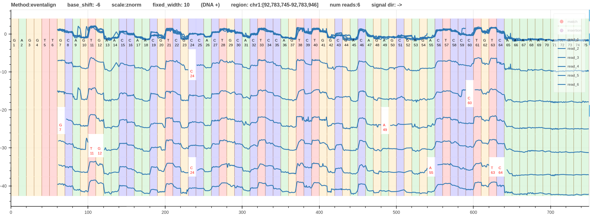
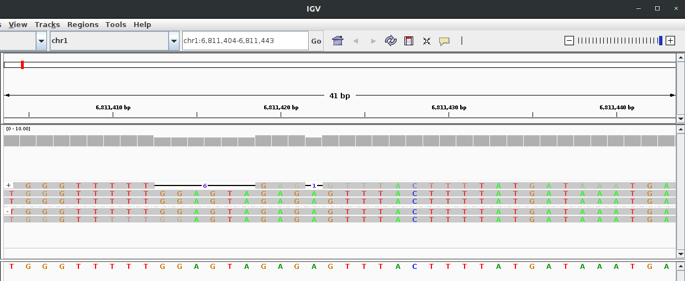
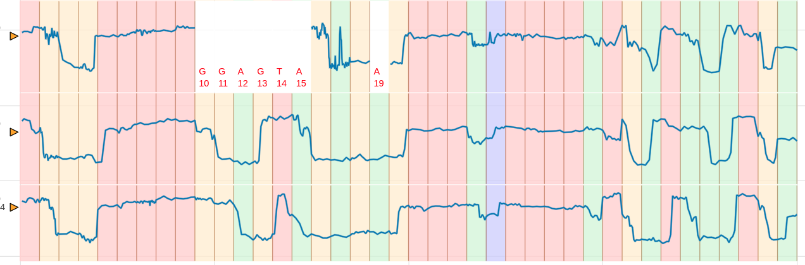
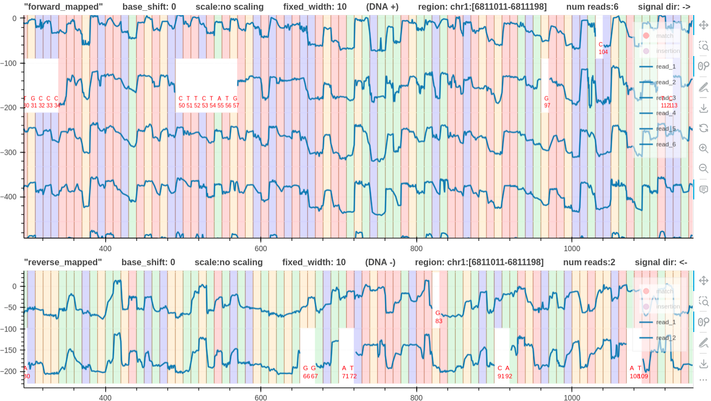
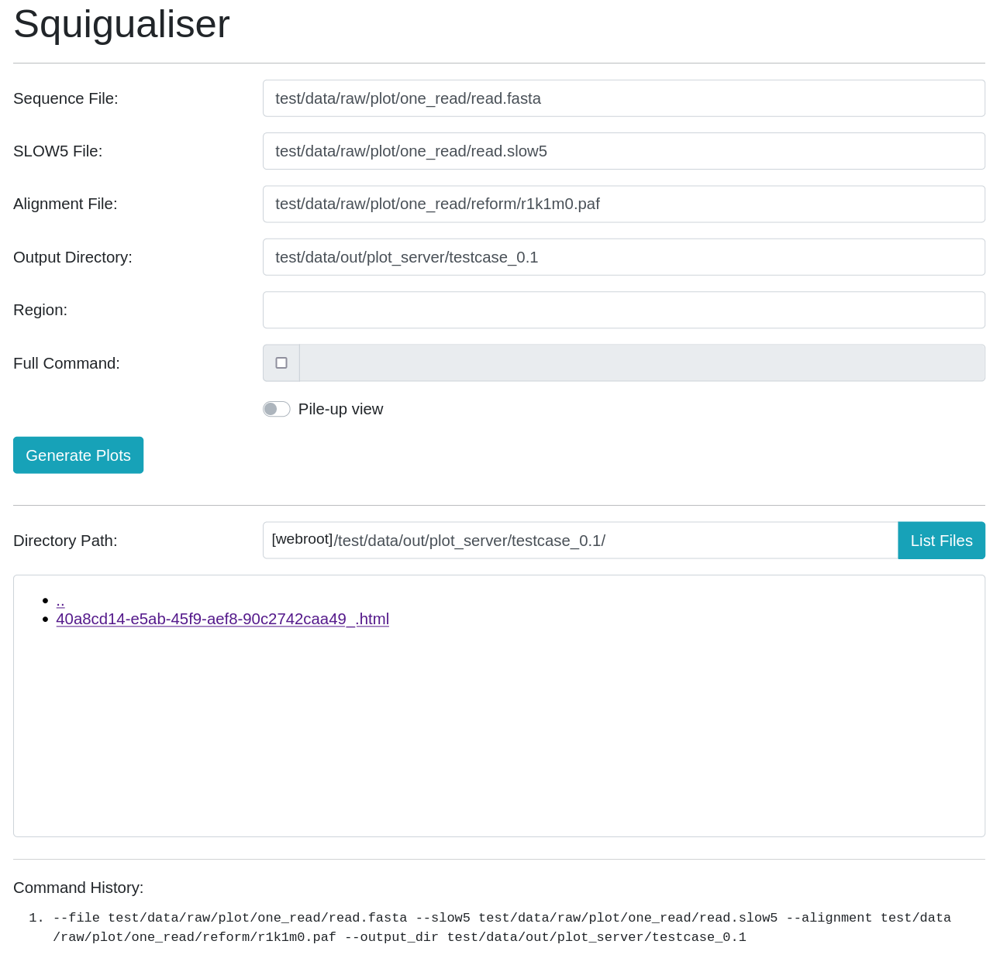
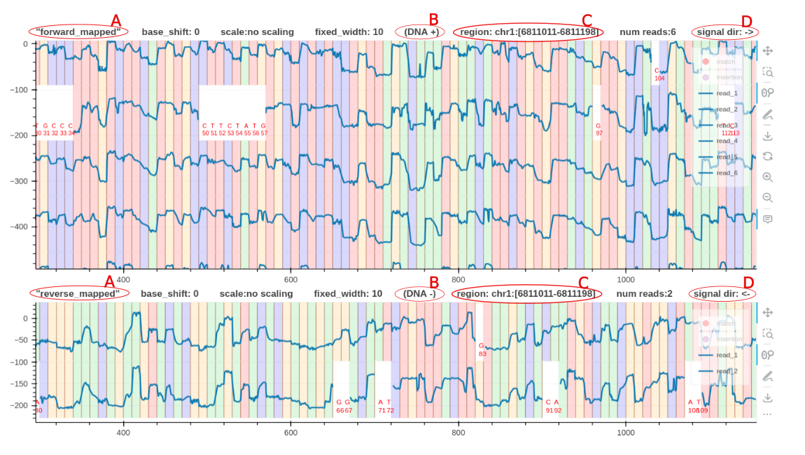
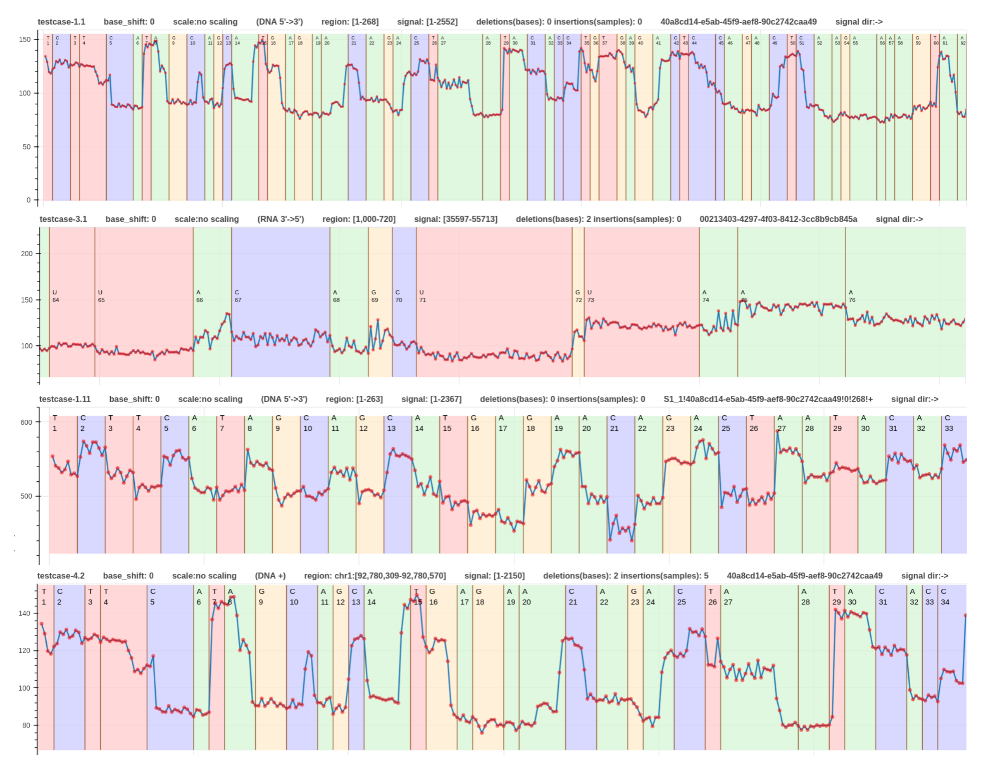

# squigualiser

squigualiser is a tool to Visualise nanopore raw signal-base alignment.
signals (**squig**gles) + vis**ualiser** = **squigualiser**

Google Chrome is the recommended web browser to visualise these plots.


[](https://pypi.python.org/pypi/squigualiser)
[](https://github.com/hiruna72/squigualiser/actions/workflows/snake.yml)


* Figure - A [pileup view](#pileup-view) of DNA R10.4.1 signals that align to the region `chr1:92,783,745-92,783,946`.
* Click the [link](https://hiruna72.github.io/squigualiser/docs/figures/different_aligments/dna_r10.4.1_e8.2_400bps_sup.cfg_evligned_vs_sim.html) to open it on your browser.
* Go to Section [Examples](#examples) for more examples.

# Table of Contents
1. [Quickstart](#quickstart)
2. [Advanced Setup](#advanced-setup)
3. [Signal to read visualisation](#signal-to-read-visualisation)
   1. [Option 1 - Using f5c resquiggle](#option-1---f5c-resquiggle)
   2. [Option 2 - Using basecaller move table](#option-2---basecaller-move-table)
   3. [Option 3 - Using squigulator signal simulation](#option-3---squigulator-signal-simulation)
5. [Signal to reference visualisation](#signal-to-reference-visualisation)
   1. [Option 1 - Using f5c eventalign](#option-1-f5c-eventalign)
   2. [Option 2 - Using basecaller move table](#option-2---basecaller-move-table-1)
   3. [Option 3 - Using squigulator signal simulation](#option-3---squigulator-signal-simulation-1)
6. [Pileup view](#pileup-view)
7. [Plot multiple tracks](#plot-multiple-tracks)
8. [BED annotations](#bed-annotations)
9. [Squigualiser GUI](#Squigualiser-gui)
10. [Visualisation Enhancements](#Visualisation-Enhancements)
   1. [Base shift](#base-shift)
   2. [Signal scaling](#signal-scaling)
11. [Plot conventions](#plot-conventions)
12. [Calculate alignment statistics](#calculate-alignment-statistics)
13. [Notes](#notes)
14. [Examples](#examples)


## Quickstart

The easiest way to setup squigualiser would be to use precompiled binaries. Click on the arrow to expand the snippet of commands for your operating system.
<details open><summary>For Linux distributions</summary>
<div markdown=1>

```
wget https://github.com/hiruna72/squigualiser/releases/download/v0.3.0/squigualiser-v0.3.0-linux-x86-64-binaries.tar.gz -O squigualiser.tar.gz
tar xf squigualiser.tar.gz
cd squigualiser
./squigualiser --help
```

</div>
</details>
<details><summary>For macOS (Apple Silicon) distributions</summary>
<div markdown=1>
   
```
curl -L https://github.com/hiruna72/squigualiser/releases/download/v0.3.0/squigualiser-v0.3.0-macos-arm64-binaries.tar.gz -O squigualiser.tar.gz
tar xf squigualiser.tar.gz
cd squigualiser
./squigualiser --help
```

</div>
</details>

For a quick test run the following:
````
wget https://hiruna72.github.io/squigualiser/docs/sample_dataset.tar.gz
# or use curl
curl -L https://hiruna72.github.io/squigualiser/docs/sample_dataset.tar.gz -o sample_dataset.tar.gz

tar xf sample_dataset.tar.gz
./squigualiser plot_pileup -f ref.fasta -s reads.blow5 -a eventalign.bam -o dir_out --region chr1:92,778,040-92,782,120 --tag_name "test_0"
````

`export PATH=[path_to_squigualiser_dir]:$PATH` to execute `squigualiser` from any location.

You can take a look at [advanced setup](#advanced-setup) below for instructions on installing using pip, conda or source.


## Advanced setup

Click on the arrow to expand the relevant section.

<details close><summary>Using python environment</summary>
   
<div markdown=1>
    
````
python3.8 -m venv venv3
source venv3/bin/activate
pip install --upgrade pip
pip install squigualiser
squigualiser --help
````
Squigualiser has been tested with python 3.8.0, which should also work with anything higher. For installing relevant python versions, see the troubleshoot section below.
</div>
</details>

<details close><summary>Using source code</summary>
<div markdown=1>

````
git clone https://github.com/hiruna72/squigualiser.git
cd squigualiser
python3.8 -m venv venv3
source venv3/bin/activate
pip install --upgrade pip
pip install --upgrade setuptools wheel

export PYSLOW5_ZSTD=1 # if your slow5 file uses zstd compression and you have zstd installed, set
python setup.py install
squigualiser --help
````

</div>
</details>

<details><summary>Using conda environment</summary>
<div markdown=1>

````
git clone https://github.com/hiruna72/squigualiser.git
cd squigualiser
conda create -n squig python=3.8.0 -y
conda activate squig

export PYSLOW5_ZSTD=1 # if your slow5 file uses zstd compression and you have zstd installed, set

python setup.py install
squigualiser --help
````

</div>
</details>

<details><summary>Troubleshoot: python versions</summary>
<div markdown=1>

You can check your Python version by invoking `python3 --version`. If your native python3 meets this requirement of >=3.8, you can use that, or use a
specific version installed with deadsnakes below. If you install with deadsnakes, you will need to call that specific python, such as python3.8 or python3.9, in all the following commands until you create a virtual environment with venv. Then once activated, you can just use python3. To install a specific version of python, the deadsnakes ppa is a good place to start:

````
# This is an example for installing python3.8
# you can then call that specific python version
# > python3.8 -m pip --version
sudo add-apt-repository ppa:deadsnakes/ppa
sudo apt-get update
sudo apt install python3.8 python3.8-dev python3.8-venv
````

</div>
</details>

<details><summary>Troubleshoot: Install zlib development libraries (and optionally zstd development libraries)</summary>
<div markdown=1>

The commands to zlib __development libraries__ on some popular distributions :
```sh
    On Debian/Ubuntu : sudo apt-get install zlib1g-dev
    On Fedora/CentOS : sudo dnf/yum install zlib-devel
    On OS X : brew install zlib
 ```

SLOW5 files compressed with *zstd* offer smaller file size and better performance compared to the default *zlib*. However, *zlib* runtime library is available by default on almost all distributions unlike *zstd* and thus files compressed with *zlib* will be more 'portable'. Enabling optional *zstd* support, requires __zstd 1.3 or higher development libraries__ installed on your system:
 ```sh
    On Debian/Ubuntu : sudo apt-get install libzstd1-dev # libzstd-dev on newer distributions if libzstd1-dev is unavailable
    On Fedora/CentOS : sudo yum libzstd-devel
    On OS X : brew install zstd
 ```

</div>
</details>

## Signal to read visualisation

This section explains how you can use squigualiser to visualise a raw signal alignment against its basecalled read. Click on the arrow to expand the revalent method.

#### Option 1 - f5c resquiggle
<details>
<summary>Steps for using f5c resquiggle signal-read alignment</summary>
<div markdown=1>

1. Install f5c [v1.3 or higher](https://github.com/hasindu2008/f5c/releases) as explained in [f5c documentation](https://github.com/hasindu2008/f5c/#quick-start).

2. Run f5c resquiggle

````
FASTQ=reads.fastq
SIGNAL_FILE=reads.blow5
ALIGNMENT=resquiggle.paf

f5c resquiggle -c ${FASTQ} ${SIGNAL_FILE} -o ${ALIGNMENT}
````
* Refer [Note(2)](#notes) for more information about `--kmer-model [KMER_MODEL]`, which is optional.
* Refer [Note(3)](#notes) for more information about RNA.

3. Plot signal to read alignment

````
OUTPUT_DIR=output_dir
squigualiser plot -f ${FASTQ} -s ${SIGNAL_FILE} -a ${ALIGNMENT} -o ${OUTPUT_DIR} # to plot a selected read ID, you can provide -r 'READ_ID'.
````

</div>
</details>


#### Option 2 - basecaller move table
<details><summary>steps for using move table generated by the basecaller</summary>
<div markdown=1>

1. Run basecaller ([slow5-dorado](https://github.com/hiruna72/slow5-dorado), [buttery-eel](https://github.com/Psy-Fer/buttery-eel) or ont-Guppy)

````
# buttery-eel (tested with v0.2.2)
buttery-eel -g [GUPPY exe path] --config [DNA model] -i [INPUT] -o [OUTPUT] --port 5558 --use_tcp -x "cuda:all" --moves_out
e.g buttery-eel -g [GUPPY exe path] --config dna_r10.4.1_e8.2_400bps_sup.cfg -i input_reads.blow5 -o basecalls.sam --port 5558 --use_tcp -x "cuda:all" --moves_out

# slow5-dorado (tested with v0.2.1)
slow5-dorado basecaller [DNA model] [INPUT] --emit-moves > [OUTPUT]
e.g. slow5-dorado basecaller dna_r10.4.1_e8.2_400bps_sup@v4.0.0 input_reads.blow5 --emit-moves > basecalls.sam

# ont-guppy (tested with v6.3.7)
guppy_basecaller -c [DNA model] -i [INPUT] --moves_out --bam_out --save_path [OUTPUT]
samtools merge pass/*.bam -o basecalls.bam # merge passed BAM files to create a single BAM file
````

2. Reformat move table ([more info about reform](docs/reform.md)).

````
# PAF output for plotting
ALIGNMENT=reform_output.paf
squigualiser reform --sig_move_offset 0 --kmer_length 1 -c --bam basecalls.sam -o ${ALIGNMENT}
````
* Refer [Note(4)](#notes) for more information on the PAF output.
* Refer [Note(5)](#notes) for a description about `sig_move_offset`.
* Refer [Note(6)](#notes) for handling a potential SAM/BAM error.

3. Plot signal to read alignment

````
FASTA_FILE=read.fasta
SIGNAL_FILE=read.blow5
OUTPUT_DIR=output_dir

# use samtools fasta command to create .fasta file from SAM/BAM file
samtools fasta basecalls.sam > ${FASTA_FILE}
# plot
squigualiser plot --file ${FASTA_FILE} --slow5 ${SIGNAL_FILE} --alignment ${ALIGNMENT} --output_dir ${OUTPUT_DIR}
````

</div>
</details>

#### Option 3 - Squigulator signal simulation

<details><summary>Steps for using Squigulator signal simulation software</summary>
<div markdown=1>

1. Setup squigulator v0.2.1 or higher as explained in the [documentation](https://github.com/hasindu2008/squigulator).

2. Simulate a signal (remember to provide -q and -c options).

````
REF=ref.fasta          #reference
READ=sim.fasta         #simulated reads
ALIGNMENT=sim.paf      #contains signal-read alignment
SIGNAL_FILE=sim.blow5  #simultated raw signal data

squigulator -x dna-r10-prom ${REF} -n 1 -o ${SIGNAL_FILE} -q ${READ} -c ${ALIGNMENT} # instead of dna-r10-prom, you can specify any other profile
````

3. Plot signal to read alignment.

````
OUTPUT_DIR=output_dir
squigualiser plot -f ${READ} -s ${SIGNAL_FILE} -a ${ALIGNMENT} -o ${OUTPUT_DIR} # to plot a selected read ID, you can provide -r 'READ_ID'.
````

</div>
</details>

## Signal to reference visualisation

This section explains how you can use squigualiser to visualise a raw signal alignment against a reference. Click on the arrow to expand the relevant method.

#### Option 1: f5c eventalign
<details><summary>Steps for using f5c eventalign</summary>
<div markdown=1>

1.  Install f5c [v1.3 or higher](https://github.com/hasindu2008/f5c/releases) as explained in [f5c documentation](https://github.com/hasindu2008/f5c/#quick-start).
2. Align reads to reference genome

````
REF=genome.fa #reference
MAP_BAM=mapped.bam
FASTQ=read.fastq
samtools fastq basecalls.sam > ${FASTQ} # if basecalls are in sam format

# For DNA
minimap2 -ax map-ont ${REF} ${FASTQ} -t8 --secondary=no | samtools sort - -o ${MAP_BAM} && samtools index ${MAP_BAM} 

# For RNA (reference must be the transcriptome)
minimap2 -ax splice -uf -k14 ${REF} ${FASTQ} -t8 --secondary=no | samtools sort - -o ${MAP_BAM} && samtools index ${MAP_BAM} 

````

3. create f5c index

````
SIGNAL=reads.blow5
f5c index ${FASTQ} --slow5 ${SIGNAL}
````
4. f5c eventalign

````
ALIGNMENT=eventalign.bam
f5c eventalign -b ${MAP_BAM} -r ${FASTQ} -g ${REF} --slow5 ${SIGNAL} -a -o eventalign.sam
samtools sort eventalign.sam -o ${ALIGNMENT}
samtools index ${ALIGNMENT}
````

5. Plot signal to reference alignment.

````
OUTPUT_DIR=output_dir
REGION=chr1:6811404-6811443
squigualiser plot -f ${REF} -s ${SIGNAL_FILE} -a ${ALIGNMENT} -o ${OUTPUT_DIR} --region ${REGION} --tag_name "eventalgin"
````

</div>
</details>

#### Option 2 - basecaller move table
<details><summary>Steps for using move table generated by the basecaller</summary>
<div markdown=1>

1. Run basecaller ([slow5-dorado](https://github.com/hiruna72/slow5-dorado), [buttery-eel](https://github.com/Psy-Fer/buttery-eel) or ont-Guppy)

````
# buttery-eel (tested with v0.2.2)
buttery-eel -g [GUPPY exe path] --config [DNA model] -i [INPUT] -o [OUTPUT] --port 5558 --use_tcp -x "cuda:all" --moves_out
e.g buttery-eel -g [GUPPY exe path] --config dna_r10.4.1_e8.2_400bps_sup.cfg -i input_reads.blow5 -o basecalls.sam --port 5558 --use_tcp -x "cuda:all" --moves_out

# slow5-dorado (tested with v0.2.1)
slow5-dorado basecaller [DNA model] [INPUT] --emit-moves > [OUTPUT]
e.g. slow5-dorado basecaller dna_r10.4.1_e8.2_400bps_sup@v4.0.0 input_reads.blow5 --emit-moves > basecalls.sam

# ont-guppy (tested with v6.3.7)
guppy_basecaller -c [DNA model] -i [INPUT] --moves_out --bam_out --save_path [OUTPUT]
samtools merge pass/*.bam -o basecalls.bam # merge passed BAM files to create a single BAM file
````

2. Reformat move table ([more info on reform](docs/reform.md)).

````
# PAF output for plotting
REFORMAT_PAF=reform_output.paf
squigualiser reform --sig_move_offset 0 --kmer_length 1 -c --bam basecalls.sam -o ${REFORMAT_PAF}

````
* Refer [Note(4)](#notes) for more information on the paf output.
* Refer [Note(5)](#notes) for a description about `sig_move_offset`.
* Refer [Note(6)](#notes) for handling a potential SAM/BAM error.

3. Align reads to reference genome

````
REF=genome.fa #reference
MAPP_SAM=map_output.sam

# For DNA
samtools fastq basecalls.sam | minimap2 -ax map-ont ${REF} -t8 --secondary=no -o ${MAPP_SAM} -

# For RNA (the reference must be the transcriptome)
samtools fastq basecalls.sam | minimap2 -ax splice -uf -k14 ${REF} -t8 --secondary=no -o ${MAPP_SAM} -

````

4. Realign reformatted move table to reference ([more info on realign](docs/realign.md)).

````
REALIGN_BAM=realign_output.bam
squigualiser realign --bam ${MAPP_SAM} --paf ${REFORMAT_PAF} -o ${REALIGN_BAM}
````

5. Plot signal to reference alignment

````
REGION=chr1:6811404-6811443
SIGNAL_FILE=read.blow5
OUTPUT_DIR=output_dir

# plot
squigualiser plot --file ${REF} --slow5 ${SIGNAL_FILE} --alignment ${REALIGN_BAM} --output_dir ${OUTPUT_DIR} --region ${REGION} --tag_name "optionA"

````

</div>
</details>

#### Option 3 - Squigulator signal simulation
<details><summary>Steps for using the signal simulation software (SAM output, recommended)</summary>
<div markdown=1>

1. Setup squigulator v0.2.1 or higher as explained in the [documentation](https://github.com/hasindu2008/squigulator).

2. Simulate a signal (remember to provide -a).
```
REF=ref.fasta #reference
READ=sim.fasta
ALIGNMENT=sorted_sim.bam
SIGNAL_FILE=sim.blow5
NUM_READS=50 #number of reads to simulate
squigulator -x dna-r10-prom ${REF} -o ${SIGNAL_FILE} -a sim.sam -n ${NUM_READS} && samtools sort sim.sam -o ${ALIGNMENT} && samtools index ${ALIGNMENT}
```

3. Plot signal to reference alignment.
````
OUTPUT_DIR=output_dir
REGION=chr1:6811404-6811443
squigualiser plot -f ${REF} -s ${SIGNAL_FILE} -a ${ALIGNMENT} -o ${OUTPUT_DIR} --region ${REGION} --tag_name "optionB"
````

</div>
</details>

<details><summary>Steps for using the signal simulation software (PAF output)</summary>
<div markdown=1>

2. Simulate a signal (remember to provide -c and --paf-ref).

````
REF=ref.fasta                 #reference
ALIGNMENT=sorted_sim.paf.gz   #sorted bgzip compressed PAF file containing signal to reference alignment
SIGNAL_FILE=sim.blow5         #simulated raw signals
NUM_READS=50                  #number of reads to simulate

For DNA
squigulator -x dna-r10-prom ${REF} -o ${SIGNAL_FILE} --paf-ref -c sim.paf -n ${NUM_READS}
sort -k6,6 -k8,8n sim.paf -o sorted_sim.paf
bgzip sorted_sim.paf
tabix -0 -b 8 -e 9 -s 6 ${ALIGNMENT}

For RNA
squigulator -x rna-r9-prom ${REF} -o ${SIGNAL_FILE} --paf-ref -c sim.paf -n ${NUM_READS}
sort -k6,6 -k9,9n sim.paf -o sorted_sim.paf
bgzip sorted_sim.paf
tabix -0 -b 9 -e 8 -s 6 ${ALIGNMENT}

````

</div>
</details>

## Pileup view



Similar to IGV pileup view now you can view the signal pileup view. To create a pileup view the following conditions should be met.
1. The plot is a signal to reference visualisation, not a signal to read.
2. A genomic region should be specified using the argument `--region`

First, create an alignment file by following the steps mentioned in [Signal to reference visualisation](#signal-to-reference-visualisation)

````
REGION=chr1:6811011-6811198
squigualiser plot_pileup -f ${REF} -s ${SIGNAL_FILE} -a ${ALIGNMENT} -o ${OUTPUT_DIR} --region ${REGION} --tag_name "pileup"
````

[Here](https://hiruna72.github.io/squigualiser/docs/figures/pileup/pileup_testcase-20.1.html) is an example DNA pileup plot created using the [testcase 20.1](test/test_plot_pileup.sh).
[Here](https://hiruna72.github.io/squigualiser/docs/figures/pileup/pileup_testcase-43.1.html) is an example RNA pileup plot created using the [testcase 43.1](test/test_plot_pileup.sh).

## Plot multiple tracks
<details><summary>For in depth analysis the user can visualize multiple pileup plots in the same web page.</summary>
<div markdown=1>



* The command `plot_tracks` only supports pileup views and takes a `command_file.txt` file as the input.
* The input file describes the number of commands, the dimension of each track, and the pileup commands.
* The following input `command_file.txt` file describes two pileup tracks with 900 and 200 heights for the first and second track respectively.
* Setting `plot_heights=*` in the `command_file.txt` or providing the argument `--auto_height` will automatically adjust the track height depending on the number of plots in each track.
* Note that the only difference between the two commands is that the second command has the additional `--plot_reverse` argument to plot reverse mapped reads. And `-o` or `--output_dir` argument is not necessary (ignored).

````
num_commands=2
plot_heights=900,200
squigualiser plot_pileup --region chr1:6,811,011-6,811,198 -f genome/hg38noAlt.fa -s reads.blow5 -a eventalign.bam --tag_name "forward_mapped"
squigualiser plot_pileup --region chr1:6,811,011-6,811,198 -f genome/hg38noAlt.fa -s reads.blow5 -a eventalign.bam --tag_name "reverse_mapped" --plot_reverse
````

Then use the `plot_tracks` command as below (remember to provide `-o`),

````
COMMAND_FILE="command_file.txt"
squigualiser plot_tracks --shared_x -f ${COMMAND_FILE} -o output_dir
````

### Plot multiple tracks examples
1. Forward and reverse mapped reads in separate tracks [link](https://hiruna72.github.io/squigualiser/docs/figures/plot_tracks/plot_tracks_testcase-30.3.html).
2. Different alignment methods (f5c eventalign and squigualiser's realign) for RNA data in separate tracks [link](https://hiruna72.github.io/squigualiser/docs/figures/plot_tracks/plot_tracks_testcase-30.3.html).
3. Real and simulated variants in separate tracks [link](https://hiruna72.github.io/squigualiser/docs/figures/variants/chr22/dna_r10.4.1_e8.2_400bps_sup.cfg_evligned_vs_sim.html).


</div>
</details>

## BED annotations
Plots support BED file annotations. Use argument `--bed [BED FILE]` to provide the bed file to the plot command.

[Here](https://hiruna72.github.io/squigualiser/docs/figures/pileup/pileup_testcase-43.1.html) is an example RNA pileup plot created using the [testcase 43.1](test/test_plot_pileup.sh) that supports bed annotations.

## Squigualiser GUI
<details><summary>For GUI lovers, plots can be generated using a web application running on localhost (http://localhost:8000/home)</summary>
<div markdown=1>




````
python src/server.py
````

</div>
</details>

## Visualisation Enhancements

### Base shift
User can shift the base sequence to the left by `n` number of bases by providing the argument `--base_shift -n` to `plot` and `plot_pileup` commands. This is helpful to correct the signal level to the base. A negative `n` value will shift the base sequence to the left.
However, the user is adviced to use `--profile` (documented [here](docs/profiles.md)) which automatically sets the `--base_shift`.
For more information please refer [base_shift and eventalignment](docs/base_shift_and_eventalignment.md) and [base_shift and reverse mapped reads](docs/base_shift_of_reverse_mapped_reads.md).

### Signal scaling
The commands `plot` and `plot_pileup` can take the argument `--sig_scale`. By providing the argument `--sig_scale znorm` or `--sig_scale medmad` the signals will be zscore or median MAD normalized respectively.


## Plot Conventions

* **A** is a descriptive tag name to identify the plot.
* **B** indicates whether the positive or negative strand was used as the reference to align the signals. For RNA this will be `RNA 3'->5'`. Squigualiser only supports RNA reads mapped to the transcriptome.
* **C** always indicates the region using the positive strand coordinates, regardless of the forward and reverse mapped plots.
* **D** indicates the true sequencing direction of the signals.


## Calculate alignment statistics
Calculate basic statistics of read/reference - signal alignments.
Check [here](docs/commands.md/#metric) for the command.
Check [here](docs/different_alignments.md) for an example.

## Notes

1. If your FASTQ file is a multi-line file (not to confuse with multi-read), then install [seqtk](https://github.com/lh3/seqtk) and use `seqtk seq -l0 in.fastq > out.fastq`  to convert multi-line FASTQ to 4-line FASTQ.
2. The optional argument `--kmer-model KMER_MODEL` can be used to specify a custom k-mer model if you wish.
3. To plot RNA signal-read alignment use the alignment file created using `f5c resquiggle --rna -c ${FASTQ} ${SIGNAL_FILE} -o ${ALIGNMENT}`. Also, provide the argument `--rna` to the visualising command. Currently, there exists no RNA kmer model for r10.4.1 chemistry.
4. The input alignment format accepted by `squigualiser plot` is explained [here](https://hasindu2008.github.io/f5c/docs/output#resquiggle). This standard format made plotting a lot easier.
5. The argument `sig_move_offset` is the number of moves `n` to skip in the signal to correct the start of the alignment. This will not skip bases in the fastq sequence. For example, to align the first move with the first kmer `--sig_move_offset 0` should be passed. To align from the second move onwards, `--sig_move_offset 1` should be used.
6. Pysam does not allow reading SAM/BAM files without a `@SQ` line in the header. Hence, `squigualiser reform` script might error out with `NotImplementedError: can not iterate over samfile without header`. Add a fake `@SQ` header line with a zero length reference as follows,
   ```
   echo -e fake_reference'\t'0 > fake_reference.fa.fai
   samtools view out.sam -h -t fake_reference.fa.fai -o sq_added_out.sam
   ```
7. Squigulator's signal simulation is a good way to understand the nature of the alignments. Please refer to the documentation about [real_vs_simulated_signal](docs/real_vs_simulated_signal.md).
8. For a explanation of the Guppy move table explanation see please refer [here](docs/move_table.md).


## Examples



1. The first read is a signal-read alignment using guppy_v.6.3.7 move table annotation ([link](https://hiruna72.github.io/squigualiser/docs/figures/sig_to_read/testcase-1.1.html)).
2. The second read is a signal-read alignment using f5c resquiggle output ([link](https://hiruna72.github.io/squigualiser/docs/figures/sig_to_read/testcase-2.1.html)).
3. The third read is a signal-read alignment using the squigulator's simulated output ([link](https://hiruna72.github.io/squigualiser/docs/figures/sig_to_read/testcase-1.11.html)).
4. The fourth read (RNA) is a signal-read alignment using f5c resquiggle output ([link](https://hiruna72.github.io/squigualiser/docs/figures/sig_to_read/testcase-3.2.html)).

* [This](https://hiruna72.github.io/squigualiser/docs/figures/sig_to_reference/testcase-8.1.html) signal-reference alignment aligns a signal to the region `chr1:4270161-4271160`.
* [This](https://hiruna72.github.io/squigualiser/docs/figures/sig_to_reference/testcase-8.2.html) is the same plot with a fixed base width.

These examples were generated using the testcases - `1.1, 2.1, 1.11,` and `3.2` respectively in [test_plot_signal_to_read.sh](test/test_plot_signal_to_read.sh).

Please refer to the example [pipelines](docs/pipeline_basic.md) to learn how to integrate squigualiser into your analysis.

## Acknowledgement
Some code snippets have been taken from [blue-crab](https://github.com/Psy-Fer/blue-crab), [buttery-eel](https://github.com/Psy-Fer/buttery-eel), [readfish](https://github.com/LooseLab/readfish) and [bonito](https://github.com/nanoporetech/bonito)
