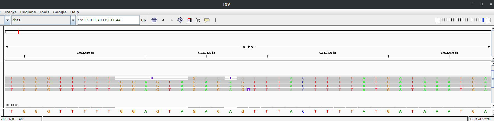
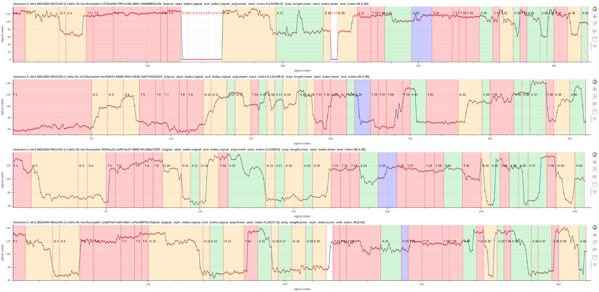

# ideal-goggles
Visualize nanopore raw signal-base alignment




1. In this figure an IGV plot shows the region chr1:6,811,403-6,811,433. 
2. The first read has deletions and the corresponding gaps appear in the signal plot [pileup_plot_0.html](test/pileup_plot_0.html).
3. The last read has an insertion and hence an insertion appears in the last signal plot. 
4. The second read is a reverse mapping and hence its shape is different from the rest.
5. Another example plot [pileup_plot_1.html](test/pileup_plot_1.html)

## INSTALLATION

### using python environment
````
git clone https://github.com/hiruna72/ideal-goggles.git
cd ideal-goggles
python3 -m venv idealg
source idealg/bin/activate
pip install -r requirements.txt
````
### using conda environment
````
git clone https://github.com/hiruna72/ideal-goggles.git
cd ideal-goggles
conda create -n idealg python=3.6.10 -y
conda activate idealg
pip install -r requirements.txt
````

## Method 1 - Read to signal visualization
1. Run basecaller ([slow5-dorado](https://github.com/hiruna72/slow5-dorado), [buttery-eel](https://github.com/Psy-Fer/buttery-eel))
```
(tested with v6.3.7)
guppy_basecaller -c [DNA model] -i [INPUT] --moves_out --bam_out --save_path [OUTPUT]

(tested with v0.2.1)
slow5-dorado basecaller [DNA model] [INPUT] --emit-moves > [OUTPUT]

(tested with v0.2.2)
buttery-eel -g [GUPPY exe path] --config [DNA model] -i [INPUT] -o [OUTPUT] --port 5558 --use_tcp -x "cuda:all"

```

2. Merge passed BAM files to create a single BAM file
```
samtools merge pass/*.bam -o pass_bam.bam
```
3. Reformat move table 
```
REFORMAT_PAF=reform_output.paf
python src/reform.py --sig_move_offset 1 --kmer_length 1 -c --bam pass_bam.bam -o ${REFORMAT_PAF}
python src/reform.py --sig_move_offset 1 --kmer_length 1 --bam pass_bam.bam -o reform_output.tsv

*visualizing only works with the paf output
```
`sig_move_offset` is the number of moves `n` to skip in the signal (`n x stride`) to correct the start of the alignment. This will not skip bases in the fastq sequence.

4. Visualize the signal to sequence alignment
````
FASTA_FILE=read.fasta
SIGNAL_FILE=read.slow5
OUTPUT_HTML=output.html

python src/sqp.py --fasta ${FASTA_FILE} --slow5 ${SIGNAL_FILE} --alignment ${REFORMAT_PAF} --output ${OUTPUT_HTML}

*use samtools fasta command to create .fasta file from SAM/BAM file
````
## Method 2 - Reference to signal visualization
The first 3 steps are same as Method 1.
1. Run basecaller
2. Merge passed BAM files to create a single BAM file
3. Reformat move table
4. Align reads to reference genome
```
REFERENCE=genome.fa
MAPP_SAM=map_output.sam
minimap2 -ax map-ont ${REFERENCE} -t32 --secondary=no pass.fastq -o ${MAP_SAM}

```
5. Realign move array to reference
```
REALIGN_BAM=realign_output.bam
python src/realign.py --bam ${MAPP_SAM} --paf ${REFORMAT_PAF} -o ${REALIGN_BAM}

```

6. Visualize the signal to sequence alignment
````
SIGNAL_FILE=read.slow5
OUTPUT_DIR=output_sqp
REGION=chr1:6811404-6811443

python src/sqp.py --fasta ${REFERENCE} --slow5 ${SIGNAL_FILE} --alignment ${REALIGN_BAM} --output_dir ${OUTPUT_DIR} --tag_name "sqp_fun" --region ${REGION}

*use samtools fasta command to create .fasta file from SAM/BAM file
````

### Note
1. Use `scripts/cat_plots.sh` to concatenate multiple .html plots in a directory.
2. Use `--no_reverse` flag to skip generating plots for reverse mapped reads.
 
## Move table explanation (unconfirmed)
Nanopore basecallers output move arrays in SAM/BAM format. The important fields are listed below.
1. read_id
2. basecalled fastq sequence length
3. basecalled fastq sequence
4. stride used in the neural network (down sampling factor)
5. raw signal length
6. raw signal trim offset
7. move table

An example move array looks like the following,
```
110100010101000101011010101111…
```
The number of ones (1) in the move array equals to the fastq sequence length. 
According to the above example the first move corresponds with `1 x stride` signal points. 
The second move corresponds with `2 x stride` signal points. The third with `4 x stride`, the fourth with `2 x stride` and so on.


## Example
````
EXAMPLE_DIR=test/data/sqp/sigb_formater
FASTA_FILE=${EXAMPLE_DIR}/read.fasta
SIGNAL_FILE=${EXAMPLE_DIR}/read.slow5
ALIGN_FILE=${EXAMPLE_DIR}/r1k1m1.paf
OUTPUT_HTML=output.html

python src/sqp.py --fasta ${FASTA_FILE} --slow5 ${SIGNAL_FILE} --alignment ${ALIGN_FILE} --output ${OUTPUT_HTML}

````
