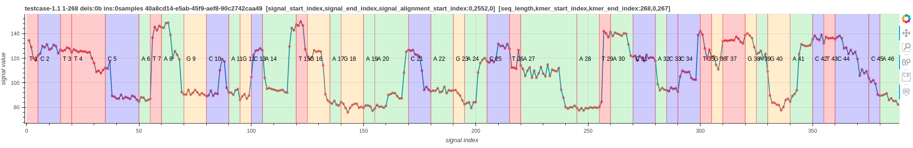
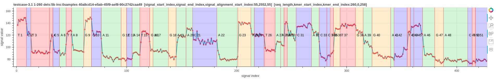
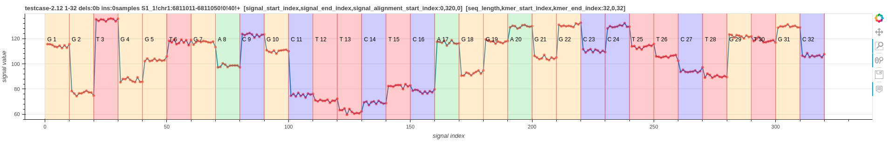
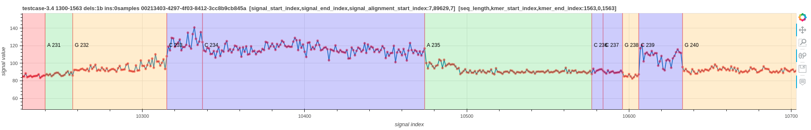

# ideal-goggles

A simple tool to Visualise nanopore raw signal-base alignment






1. The first read is the signal-base alignment using guppy_v.3.6.7 move table annotation.
2. The second read is the signal-base alignment using f5c resquiggle output.
3. The third read is the signal-base alignment using the squigulator's simulated output.
4. The fourth read (RNA) is the signal-base alignment using f5c resquiggle output.

## INSTALLATION

### using python environment
````
git clone https://github.com/hiruna72/ideal-goggles.git
cd ideal-goggles
python3 -m venv idealg
source idealg/bin/activate
pip install --upgrade pip
pip install -r requirements.txt
````
### using conda environment
````
git clone https://github.com/hiruna72/ideal-goggles.git
cd ideal-goggles
conda create -n idealg python=3.6.10 -y
conda activate idealg
pip install -r requirements.txt
````

## Signal to base visualisation
### Method 1 - Using move table generated by the basecaller
1. Run basecaller ([slow5-dorado](https://github.com/hiruna72/slow5-dorado), [buttery-eel](https://github.com/Psy-Fer/buttery-eel) or ont-Guppy)
```
# buttery-eel (tested with v0.2.2)
buttery-eel -g [GUPPY exe path] --config [DNA model] -i [INPUT] -o [OUTPUT] --port 5558 --use_tcp -x "cuda:all" --moves_out
e.g buttery-eel -g [GUPPY exe path] --config dna_r10.4.1_e8.2_400bps_sup.cfg -i input_reads.blow5 -o out.sam --port 5558 --use_tcp -x "cuda:all" --moves_out 

# slow5-dorado (tested with v0.2.1)
slow5-dorado basecaller [DNA model] [INPUT] --emit-moves > [OUTPUT]
e.g. slow5-dorado basecaller dna_r10.4.1_e8.2_400bps_sup@v4.0.0 input_reads.blow5 --emit-moves > out.sam

# ont-guppy (tested with v6.3.7)
guppy_basecaller -c [DNA model] -i [INPUT] --moves_out --bam_out --save_path [OUTPUT]
samtools merge pass/*.bam -o pass_bam.bam # merge passed BAM files to create a single BAM file
```

2. Reformat move table 
```
# PAF output for plotting
REFORMAT_PAF=reform_output.paf
python src/reform.py --sig_move_offset 1 --kmer_length 1 -c --bam out.sam -o ${REFORMAT_PAF}

# For human readability you may prefer the tsv output (not supported for plotting)
python src/reform.py --sig_move_offset 1 --kmer_length 1 --bam out.sam -o reform_output.tsv

```
* Refer [Note(5)](#note) for more information on the paf output.
* Refer [Note(6)](#note) for a description about `sig_move_offset`.
* Refer [Note(7)](#note) for handling a potential SAM/BAM error.

3. Visualise the signal-base alignment
````
FASTA_FILE=read.fasta
SIGNAL_FILE=read.blow5
OUTPUT_DIR=output_dir

# use samtools fasta command to create .fasta file from SAM/BAM file
samtools fasta out.sam > ${FASTA_FILE}
# plot it
python src/sqp.py --file ${FASTA_FILE} --slow5 ${SIGNAL_FILE} --alignment ${REFORMAT_PAF} --output_dir ${OUTPUT_DIR}
````

### Method 2 - Using F5c resquiggle signal-base alignment
1. Build [F5c r10 branch](https://github.com/hasindu2008/f5c/tree/r10) by following the instructions listed in [F5c README](https://github.com/hasindu2008/f5c/blob/r10/README.md)

2. Run f5c resquiggle
```
FASTQ=reads.fastq
SIGNAL_FILE=reads.blow5
ALIGNMENT=move.paf

f5c resquiggle --kmer-model [KMER_MODEL] -c ${FASTQ} ${SIGNAL_FILE} -o ${ALIGNMENT}
```
* Refer [Note(3)](#note) for more information about `KMER_MODEL`.
* Refer [Note(4)](#note) for more information about RNA.

3. Visualise the signal-base alignment
````
OUTPUT_DIR=output_dir

# plot it
python src/sqp.py --file ${FASTQ} --slow5 ${SIGNAL_FILE} --alignment ${ALIGNMENT} --output_dir ${OUTPUT_DIR}
````

### Method 3 - Using the signal simulation software - Squigulator
1. Build [Squigulator r10 branch](https://github.com/hasindu2008/squigulator/tree/r10) by following the instructions listed in [Squigulator README](https://github.com/hasindu2008/squigulator/blob/r10/README.md)

2. Simulate a signal
```
FASTA=read.fasta (the read to simulate)
KMER_MODEL=path/to/kmer-model
ALIGNMENT=sim.paf
SIGNAL_FILE=sim.slow5

squigulator --seed 1 --full-contigs --ideal-time --amp-noise 0.4 -x dna-r10-prom --kmer-model ${KMER_MODEL} ${FASTA} -c ${ALIGNMENT} -o ${SIGNAL_FILE}
```
* Refer [Note(3)](#note) for more information about `KMER_MODEL`.

3. Visualise the signal-base alignment
````
OUTPUT_DIR=output_dir

# plot it
python src/sqp.py --file ${FASTA} --slow5 ${SIGNAL_FILE} --alignment ${ALIGNMENT} --output_dir ${OUTPUT_DIR}
````

## Note
1. To get a pileup view, use [scripts/cat_plots.sh](scripts/cat_plots.sh) to concatenate multiple `.html` plots in a directory.
2. If your FASTQ file is a multi-line file (not to confuse with multi-read), then install [seqtk](https://github.com/lh3/seqtk) and use `seqtk seq -l0 in.fastq > out.fastq`  to convert multi-line FASTQ to 4-line FASTQ.
3. The argument `KMER_MODEL` is optional. For r10.4.1 dna reads use [this](https://github.com/hasindu2008/f5c/blob/r10/test/r10-models/r10.4.1_400bps.nucleotide.9mer.template.model) model.
4. To visualize RNA signal-base alignment use `f5c resquiggle --rna -c ${FASTQ} ${SIGNAL_FILE} -o ${ALIGNMENT}`. Currently, there exists no RNA kmer model for r10.4.1 chemistry.
5. The input alignment format accepted by `sqp.py` script is explained [here](https://hasindu2008.github.io/f5c/docs/output#resquiggle).
6. The argument `sig_move_offset` is the number of moves `n` to skip in the signal (`n x stride`) to correct the start of the alignment. This will not skip bases in the fastq sequence.
7. Pysam does not allow reading SAM/BAM files without a `@SQ` line in the header. Hence, `reform.py` script might error out with `NotImplementedError: can not iterate over samfile without header`. Add a fake `@SQ` header line with a zero length reference as follows,
```
echo -e fake_reference'\t'0 > fake_reference.fa.fai
samtools view out.sam -h -t fake_reference.fa.fai -o sq_added_out.sam
```

## Move table explanation (unconfirmed)
Nanopore basecallers output move arrays in SAM/BAM format. The important fields are listed below.
1. read_id
2. basecalled fastq sequence length
3. basecalled fastq sequence
4. stride used in the neural network (down sampling factor)
5. raw signal length
6. raw signal trim offset
7. move table

An example move array looks like the following,
```
110100010101000101011010101111…
```
The number of ones (1) in the move array equals to the fastq sequence length. 
According to the above example the first move corresponds with `1 x stride` signal points. 
The second move corresponds with `2 x stride` signal points. The third with `4 x stride`, the fourth with `2 x stride` and so on.


## Example
The figures on the top of the document were generated using testcases - `testcase-1.1, 2.12, 3.1, 3.4` in the [test_sqp.sh](test/test_sqp.sh).
