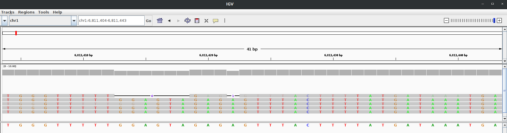
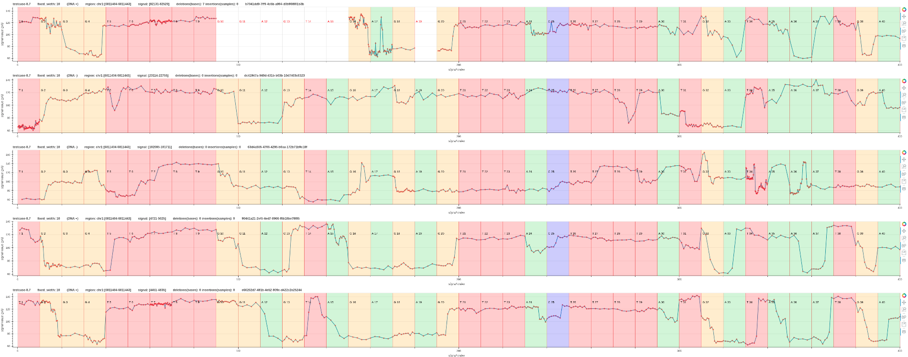

# squigualiser

A simple tool to Visualise nanopore raw signal-base alignment


1. The first read is a signal-read alignment using guppy_v.6.3.7 move table annotation ([link](https://hiruna72.github.io/squigualiser/docs/figures/sig_to_read/testcase-1.1.html)).
2. The second read is a signal-read alignment using f5c resquiggle output ([link](https://hiruna72.github.io/squigualiser/docs/figures/sig_to_read/testcase-2.1.html)).
3. The third read is a signal-read alignment using the squigulator's simulated output ([link](https://hiruna72.github.io/squigualiser/docs/figures/sig_to_read/testcase-1.11.html)).
4. The fourth read (RNA) is a signal-read alignment using f5c resquiggle output ([link](https://hiruna72.github.io/squigualiser/docs/figures/sig_to_read/testcase-3.2.html)).

[This](https://hiruna72.github.io/squigualiser/docs/figures/sig_to_reference/testcase-8.1.html) signal-reference alignment aligns a signal to the region `chr1:4270161-4271160`.

# Table of Contents
1. [Installation](#installation)
2. [Signal to read visualisation](#signal-to-read-visualisation)
   1. [Option 1 - Using move table generated by the basecaller](#option-1---using-move-table-generated-by-the-basecaller)
   2. [Option 2 - Using f5c resquiggle signal-read alignment](#option-2---using-f5c-resquiggle-signal-read-alignment)
   3. [Option 3 - Using the signal simulation software - Squigulator](#option-3---using-the-signal-simulation-software---squigulator)
3. [Signal to reference visualisation](#signal-to-reference-visualisation)
   1. [Option A - Using move table generated by the basecaller](#option-a---using-move-table-generated-by-the-basecaller)
   2. [Option B - Using the signal simulation software - Squigulator](#option-b---using-the-signal-simulation-software---squigulator)
   3. [Option C - Using F5c eventalign](#option-c---using-f5c-eventalign)
4. [Pileup view](#pileup-view)
5. [Squigualiser website](#Squigualiser-website)
6. [Note](#note)
7. [Guppy move table explanation](#guppy-move-table-explanation)
8. [Base shift](#base-shift)
9. [Example](#example)


## Installation
<details open><summary>using python environment (tested with python 3.9, should work with anything higher as well)</summary>

````
git clone https://github.com/hiruna72/squigualiser.git
cd squigualiser
python3.9 -m venv venv3
source venv3/bin/activate
pip install --upgrade pip
pip install --upgrade setuptools wheel

export PYSLOW5_ZSTD=1 # if your slow5 file uses zstd compression and you have zstd installed, set
python setup.py install
squigualiser --help
````
</details>

<details><summary>using conda environment</summary>

````
git clone https://github.com/hiruna72/squigualiser.git
cd squigualiser
conda create -n squig python=3.9 -y
conda activate squig

export PYSLOW5_ZSTD=1 # if your slow5 file uses zstd compression and you have zstd installed, set

python setup.py install
squigualiser --help
````
</details>

## Signal to read visualisation

### Option 1 - Using move table generated by the basecaller
<details>
<summary>Click to expand</summary>

1. Run basecaller ([slow5-dorado](https://github.com/hiruna72/slow5-dorado), [buttery-eel](https://github.com/Psy-Fer/buttery-eel) or ont-Guppy)
```
# buttery-eel (tested with v0.2.2)
buttery-eel -g [GUPPY exe path] --config [DNA model] -i [INPUT] -o [OUTPUT] --port 5558 --use_tcp -x "cuda:all" --moves_out
e.g buttery-eel -g [GUPPY exe path] --config dna_r10.4.1_e8.2_400bps_sup.cfg -i input_reads.blow5 -o out.sam --port 5558 --use_tcp -x "cuda:all" --moves_out 

# slow5-dorado (tested with v0.2.1)
slow5-dorado basecaller [DNA model] [INPUT] --emit-moves > [OUTPUT]
e.g. slow5-dorado basecaller dna_r10.4.1_e8.2_400bps_sup@v4.0.0 input_reads.blow5 --emit-moves > out.sam

# ont-guppy (tested with v6.3.7)
guppy_basecaller -c [DNA model] -i [INPUT] --moves_out --bam_out --save_path [OUTPUT]
samtools merge pass/*.bam -o pass_bam.bam # merge passed BAM files to create a single BAM file
```

2. Reformat move table 
```
# PAF output for plotting
ALIGNMENT=reform_output.paf
squigualiser reform --sig_move_offset 0 --kmer_length 1 -c --bam out.sam -o ${ALIGNMENT}

# For human readability you may prefer the tsv output (not supported for plotting)
squigualiser reform --sig_move_offset 0 --kmer_length 1 --bam out.sam -o reform_output.tsv

```
* Refer [Note(5)](#note) for more information on the paf output.
* Refer [Note(6)](#note) for a description about `sig_move_offset`.
* Refer [Note(7)](#note) for handling a potential SAM/BAM error.

3. Plot signal to read alignment
````
FASTA_FILE=read.fasta
SIGNAL_FILE=read.blow5
OUTPUT_DIR=output_dir

# use samtools fasta command to create .fasta file from SAM/BAM file
samtools fasta out.sam > ${FASTA_FILE}
# plot
squigualiser plot --file ${FASTA_FILE} --slow5 ${SIGNAL_FILE} --alignment ${ALIGNMENT} --output_dir ${OUTPUT_DIR}
````
</details>

### Option 2 - Using f5c resquiggle signal-read alignment
<details>
<summary>Click to expand</summary>

1. For r10 data, build [f5c r10 branch](https://github.com/hasindu2008/f5c/tree/r10) by following the instructions listed in [f5c README](https://github.com/hasindu2008/f5c/blob/r10/README.md). For r9 data, the [f5c binaries](https://github.com/hasindu2008/f5c#quick-start) are sufficient.

2. Run f5c resquiggle
```
FASTQ=reads.fastq
SIGNAL_FILE=reads.blow5
ALIGNMENT=resquiggle.paf

f5c resquiggle --kmer-model [KMER_MODEL] -c ${FASTQ} ${SIGNAL_FILE} -o ${ALIGNMENT} 
```
* Refer [Note(3)](#note) for more information about `KMER_MODEL`.
* Refer [Note(4)](#note) for more information about RNA.

3. Plot signal to read alignment
````
OUTPUT_DIR=output_dir
squigualiser plot -f ${FASTQ} -s ${SIGNAL_FILE} -a ${ALIGNMENT} -o ${OUTPUT_DIR} # to plot a selected read ID, you can provide -r 'READ_ID'.
````
</details>

### Option 3 - Using the signal simulation software - Squigulator
<details>
<summary>Click to expand</summary>

1.  Build the latest commit of [squigulator](https://github.com/hasindu2008/squigulator).

2. Simulate a signal (remember to provide -q and -c options).
```
REF=ref.fasta #reference
READ=sim.fasta
ALIGNMENT=sim.paf
SIGNAL_FILE=sim.blow5

squigulator -x dna-r10-prom ${REF} -n 1 -o ${SIGNAL_FILE} -q ${READ} -c ${ALIGNMENT}
```

3. Plot signal to read alignment.
````
OUTPUT_DIR=output_dir
squigualiser plot -f ${READ} -s ${SIGNAL_FILE} -a ${ALIGNMENT} -o ${OUTPUT_DIR} # to plot a selected read ID, you can provide -r 'READ_ID'.
````
</details>

## Signal to reference visualisation
### Option A - Using move table generated by the basecaller
<details>
<summary>Click to expand</summary>

1. Run basecaller ([slow5-dorado](https://github.com/hiruna72/slow5-dorado), [buttery-eel](https://github.com/Psy-Fer/buttery-eel) or ont-Guppy)
```
# buttery-eel (tested with v0.2.2)
buttery-eel -g [GUPPY exe path] --config [DNA model] -i [INPUT] -o [OUTPUT] --port 5558 --use_tcp -x "cuda:all" --moves_out
e.g buttery-eel -g [GUPPY exe path] --config dna_r10.4.1_e8.2_400bps_sup.cfg -i input_reads.blow5 -o out.sam --port 5558 --use_tcp -x "cuda:all" --moves_out 

# slow5-dorado (tested with v0.2.1)
slow5-dorado basecaller [DNA model] [INPUT] --emit-moves > [OUTPUT]
e.g. slow5-dorado basecaller dna_r10.4.1_e8.2_400bps_sup@v4.0.0 input_reads.blow5 --emit-moves > out.sam

# ont-guppy (tested with v6.3.7)
guppy_basecaller -c [DNA model] -i [INPUT] --moves_out --bam_out --save_path [OUTPUT]
samtools merge pass/*.bam -o pass_bam.bam # merge passed BAM files to create a single BAM file
```

2. Reformat move table 
```
# PAF output for plotting
ALIGNMENT=reform_output.paf
squigualiser reform --sig_move_offset 0 --kmer_length 1 -c --bam out.sam -o ${ALIGNMENT}

# For human readability you may prefer the tsv output (not supported for plotting)
squigualiser reform --sig_move_offset 0 --kmer_length 1 --bam out.sam -o reform_output.tsv

```
* Refer [Note(5)](#note) for more information on the paf output.
* Refer [Note(6)](#note) for a description about `sig_move_offset`.
* Refer [Note(7)](#note) for handling a potential SAM/BAM error.

3. Align reads to reference genome
```
REF=genome.fa #reference
MAPP_SAM=map_output.sam
samtools fastq out.sam | minimap2 -ax map-ont ${REF} -t8 --secondary=no -o ${MAPP_SAM} -

```

4. Realign move array to reference
```
REALIGN_BAM=realign_output.bam
squigualiser realign --bam ${MAPP_SAM} --paf ${REFORMAT_PAF} -o ${REALIGN_BAM}
```

5. Plot signal to reference alignment
````
REGION=chr1:6811404-6811443
SIGNAL_FILE=read.blow5
OUTPUT_DIR=output_dir

# use samtools fasta command to create .fasta file from SAM/BAM file
samtools fasta out.sam > ${FASTA_FILE}
# plot
squigualiser plot --file ${REF} --slow5 ${SIGNAL_FILE} --alignment ${ALIGNMENT} --output_dir ${OUTPUT_DIR} --region ${REGION} --tag_name "optionA"

````
</details>

### Option B - Using the signal simulation software - Squigulator
<details>
<summary>Click to expand</summary>

1.  Build the latest commit of [squigulator](https://github.com/hasindu2008/squigulator).

2. Simulate a signal (remember to provide -a).
```
REF=ref.fasta #reference
READ=sim.fasta
ALIGNMENT=sorted_sim.bam
SIGNAL_FILE=sim.blow5
NUM_READS=50 #number of reads to simulate
squigulator -x dna-r10-prom ${REF} -o ${SIGNAL_FILE} -a sim.sam -n ${NUM_READS} && samtools sort sim.sam -o ${ALIGNMENT} && samtools index ${ALIGNMENT}
```

3. Plot signal to reference alignment.
````
OUTPUT_DIR=output_dir
REGION=chr1:6811404-6811443
squigualiser plot -f ${REF} -s ${SIGNAL_FILE} -a ${ALIGNMENT} -o ${OUTPUT_DIR} --region ${REGION} --tag_name "optionB"
````
</details>

Note that Squigulator also supports PAF output but SAM output is recommended.
<details>
<summary>Click to expand</summary>

2. Simulate a signal (remember to provide -c and --paf-ref).
```
REF=ref.fasta                 #reference
ALIGNMENT=sorted_sim.paf.gz   #sorted bgzip compressed PAF file containing signal to reference alignment
SIGNAL_FILE=sim.blow5         #simulated raw signals   
NUM_READS=50                  #number of reads to simulate

For DNA
squigulator -x dna-r10-prom ${REF} -o ${SIGNAL_FILE} --paf-ref -c sim.paf -n ${NUM_READS}
sort -k6,6 -k8,8n sim.paf -o sorted_sim.paf
bgzip sorted_sim.paf 
tabix -0 -b 8 -e 9 -s 6 ${ALIGNMENT}

For RNA
squigulator -x rna-r9-prom ${REF} -o ${SIGNAL_FILE} --paf-ref -c sim.paf -n ${NUM_READS}
sort -k6,6 -k9,9n sim.paf -o sorted_sim.paf
bgzip sorted_sim.paf 
tabix -0 -b 9 -e 8 -s 6 ${ALIGNMENT}

```
</details>

### Option C - Using F5c eventalign
<details>
<summary>Click to expand</summary>

1. Align reads to reference genome
```
REF=genome.fa #reference
MAP_SAM=mapped.sam
FASTQ=read.fastq
samtools fastq basecaller_out.sam > ${FASTQ}
minimap2 -ax map-ont ${REF} ${FASTQ} -t8 --secondary=no -o ${MAP_SAM}
```
2. create f5c index
```
SIGNAL=reads.blow5
f5c index ${FASTQ} --slow5 ${SIGNAL}
```
3. f5c eventalign
```
ALIGNMENT=eventalign.bam
f5c eventalign -b ${MAP_SAM} -r ${FASTQ} -g ${REF} --slow5 ${SIGNAL} -a -o eventalign.sam
samtools sort eventalign.sam -o ${ALIGNMENT}
samtools index ${ALIGNMENT}

```
4. Plot signal to reference alignment.
````
OUTPUT_DIR=output_dir
REGION=chr1:6811404-6811443
squigualiser plot -f ${REF} -s ${SIGNAL_FILE} -a ${ALIGNMENT} -o ${OUTPUT_DIR} --region ${REGION} --tag_name "eventalgin"
````
</details>

## Pileup view



Similar to IGV pileup view now you can view the signal pileup view. To create a pileup view the following conditions should be met.
1. The plot is a signal to reference visualisation, not a signal to read.
2. A genomic region should be specified using the argument `--region`

````
REGION=chr1:6811011-6811198
squigualiser plot_pileup -f ${REF} -s ${SIGNAL_FILE} -a ${ALIGNMENT} -o ${OUTPUT_DIR} --region ${REGION} --tag_name "pileup"
````
[Here](https://hiruna72.github.io/squigualiser/docs/figures/pileup/pileup_testcase-20.1.html) is an example pileup plot created using the [testcase 20.1](test/test_plot_pileup.sh).

## Squigualiser website
<details>
<summary>Click to expand</summary>


For GUI lovers, plots can be generated using a website running on localhost (http://localhost:8000/home)

````
python src/server.py
````
</details>

## Note
1. To get a pileup view, use [scripts/cat_plots.sh](scripts/cat_plots.sh) to concatenate multiple `.html` plots in a directory.
2. If your FASTQ file is a multi-line file (not to confuse with multi-read), then install [seqtk](https://github.com/lh3/seqtk) and use `seqtk seq -l0 in.fastq > out.fastq`  to convert multi-line FASTQ to 4-line FASTQ.
3. The argument `KMER_MODEL` is optional. For r10.4.1 dna reads use [this](https://github.com/hasindu2008/f5c/blob/r10/test/r10-models/r10.4.1_400bps.nucleotide.9mer.template.model) model.
4. To plot RNA signal-read alignment use the alignment file created using `f5c resquiggle --rna -c ${FASTQ} ${SIGNAL_FILE} -o ${ALIGNMENT}`. Also provide the argument `--rna` to the visualising command. Currently, there exists no RNA kmer model for r10.4.1 chemistry.
5. The input alignment format accepted by `squigualiser plot` is explained [here](https://hasindu2008.github.io/f5c/docs/output#resquiggle). This standard format made plotting a lot easier.
6. The argument `sig_move_offset` is the number of moves `n` to skip in the signal to correct the start of the alignment. This will not skip bases in the fastq sequence. For example, to align the first move with the first kmer `--sig_move_offset 0` should be passed. To align from the second move onwards, `--sig_move_offset 1` should be used.
7. Pysam does not allow reading SAM/BAM files without a `@SQ` line in the header. Hence, `squigualiser reform` script might error out with `NotImplementedError: can not iterate over samfile without header`. Add a fake `@SQ` header line with a zero length reference as follows,
```
echo -e fake_reference'\t'0 > fake_reference.fa.fai
samtools view out.sam -h -t fake_reference.fa.fai -o sq_added_out.sam
```

## Base shift
User can shift the base sequence to right or left by `n` number of bases by providing the argument `--base_shift n` to the `plot` command. This is helpful to correct the signal level to the base. A positive `n` value will shift the base sequence to the right. A negative `n` value will shift the base sequence to the left.

## Guppy move table explanation
<details>
<summary>Click to expand</summary>

Nanopore basecallers output move arrays in SAM/BAM format. The important fields are listed below.
1. read_id
2. basecalled fastq sequence length
3. basecalled fastq sequence
4. raw signal length in `ns` tag
5. raw signal trim offset in `ts` tag
6. move table in `mv` tag
7. stride used in the neural network (down sampling factor) in `mv` tag

An example move table looks like the following,
```
How the auxiliary field is stored in SAM format -> mv:B:c:5,1,1,0,1,0,0,0,1,0,1,0,1,0,0,0,1,0,1,0,1,1,0,1,0,1,0,1,1,1,1,…
Stride (always the first integer) -> 5
The actual move array (the rest) -> 1,1,0,1,0,0,0,1,0,1,0,1,0,0,0,1,0,1,0,1,1,0,1,0,1,0,1,1,1,1,…
```
The number of ones (1) in the actual move array equals to the fastq sequence length. 
According to the above example the first move corresponds with `1 x stride` signal points. 
The second move corresponds with `2 x stride` signal points. The third with `4 x stride`, the fourth with `2 x stride` and so on (see illustration below).


</details>

## Example
The figures on the top of the document were generated using the testcases - `1.1, 2.1, 1.11,` and `3.2` respectively in [test_plot_signal_to_read.sh](test/test_plot_signal_to_read.sh).
