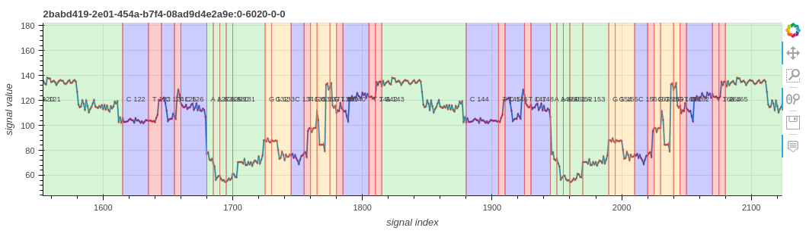

# ideal-goggles
Visualize nanopore raw signal-base alignment



## INSTALLATION

### using python environment
````
git clone git@github.com:hiruna72/ideal-goggles.git
cd ideal-goggles
conda create -n idealg python=3.6.10 -y
conda activate idealg
pip install -r requirements.txt
````
### using conda environment
````
git clone git@github.com:hiruna72/ideal-goggles.git
cd ideal-goggles
python3 -m venv idealg
source idealg/bin/activate
pip install -r requirements.txt
````

## STEPS
1. Create a signal-base alignment PAF file using `sigb_formater` tool in [poregen](https://github.com/hiruna72/poregen)
2. Visualize the signal to sequence alignment
````
FASTQ_FILE=read.fastq
SIGNAL_FILE=read.slow5
ALIGN_FILE=read_signal_alignment.paf
OUTPUT_HTML=output.html

python src/sqp.py --fastq ${FASTQ_FILE} --slow5 ${SIGNAL_FILE} --alignment ${ALIGN_FILE} --output ${OUTPUT_HTML}

````

## Example
````
EXAMPLE_DIR=test/data/sqp/sigb_formater
FASTQ_FILE=${EXAMPLE_DIR}/read.fastq
SIGNAL_FILE=${EXAMPLE_DIR}/read.slow5
ALIGN_FILE=${EXAMPLE_DIR}/r1k1m1.paf
OUTPUT_HTML=output.html

python src/sqp.py --fastq ${FASTQ_FILE} --slow5 ${SIGNAL_FILE} --alignment ${ALIGN_FILE} --output ${OUTPUT_HTML}

````
