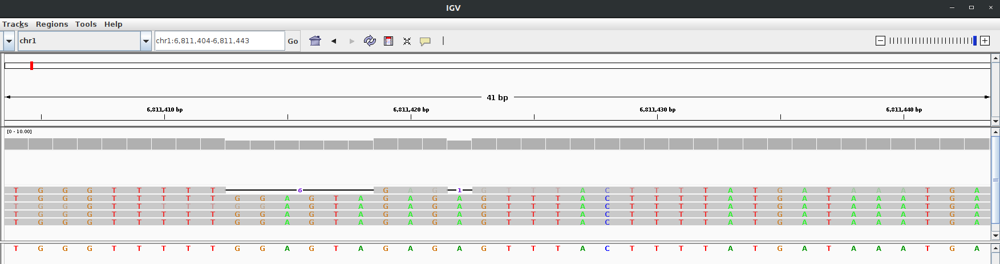

# squigualiser

A simple tool to Visualise nanopore raw signal-base alignment




1. In this figure an IGV plot shows the region chr1:6,811,403-6,811,433. 
2. The first read has deletions and the corresponding gaps appear in the signal plot [pileup_plot_0.html](test/pileup_plot_0.html).
3. The last read has an insertion and hence an insertion appears in the last signal plot. 
4. The second read is a reverse mapping and hence its shape is different from the rest.
5. Another example plot [pileup_plot_1.html](test/pileup_plot_1.html)

## Method 2 - Reference to signal visualisation
The first 2 steps are same as Method 1.
1. Run basecaller (creates out.sam)
2. Reformat move table (creates reform_output.paf)
3. Align reads to reference genome
```
REFERENCE=genome.fa
MAPP_SAM=map_output.sam
samtools fastq out.sam | minimap2 -ax map-ont ${REFERENCE} -t8 --secondary=no -o ${MAPP_SAM} -

```
5. Realign move array to reference
```
REALIGN_BAM=realign_output.bam
python src/realign.py --bam ${MAPP_SAM} --paf ${REFORMAT_PAF} -o ${REALIGN_BAM}
```

6. Visualise the signal to sequence alignment
````
SIGNAL_FILE=read.slow5
OUTPUT_DIR=output_dir
REGION=chr1:6811404-6811443

python src/plot.py --fasta ${REFERENCE} --slow5 ${SIGNAL_FILE} --alignment ${REALIGN_BAM} --output_dir ${OUTPUT_DIR} --tag_name "sqp_fun" --region ${REGION}
````

### Note
1. To get a pileup view, use `scripts/cat_plots.sh` to concatenate multiple `.html` plots in a directory.
2. To skip generating plots for reads mapped in reverse, use `--no_reverse` flag.

