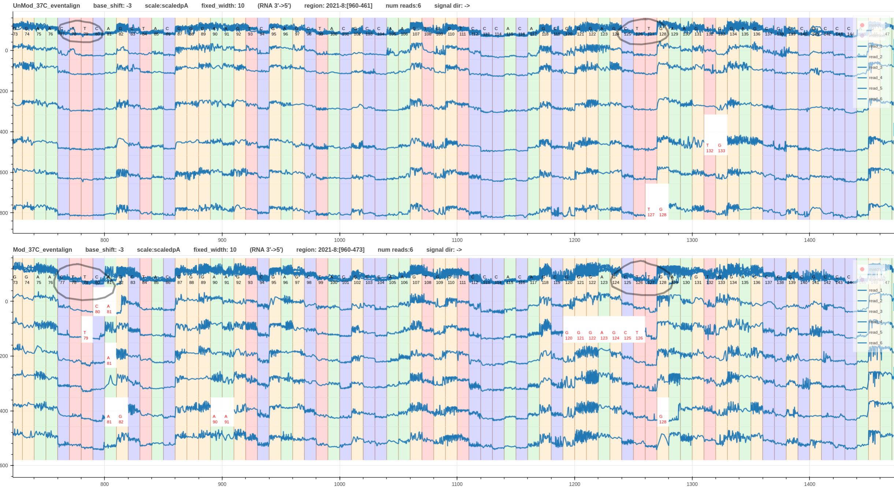

# RNA visualisation

Here we will look at synthetic direct RNA data from ONT `rna_r9.4.1_70bps` chemistry.
We thank Dr. Helen Gunter and her team at https://gih.uq.edu.au/ for providing early access to this data.

| Dataset name | SRA accession description                | Preparation                                   | Location of FAST5 data                                                         |
|--------------|------------------------------------------|-----------------------------------------------|--------------------------------------------------------------------------------|
| unmethylated | direct RNA-seq of GFP mRNA (SRR22888949) | synthetic RNA with all sites **unmethylated** | s3://sra-pub-src-6/SRR22888949/dRNA_UnMod_37C_NEBT7_BaseGfpmRNA_Fast5.tar.gz.1 |
| metylatedU   | direct RNA-seq of GFP mRNA (SRR22888950) | synthetic RNA with all Us **methylated**      | s3://sra-pub-src-6/SRR22888950/dRNA_Mod_37C_NEBT7_BaseGfpmRNA_Fast5.tar.gz.1   |

We did the following steps for the two datasets.
1. Basecall using `guppy_v6.3.7` with the model `rna_r9.4.1_70bps_hac_prom.cfg`.
2. Read alignment usign minimap2
3. Realign using squigualiser
4. Eventalign using f5c
5. Pore model training using nanopolish

With the default parameters bascalling reported 92% and 62% pass reads percentage for the unmethylated and methylatedU datasets respectively.
The very low pass percentage (62%) for the methylatedU indicates that the synthetically methylated U has a very different signal nature than the normal U.
This effect has made the basecalling models erroneous around Us.

This can be further confirmed by looking at the metrics after aligning the passed reads to the synthetic reference.

|              | minimap2 parameters |                                      | reads  |        |          |              | bases     |           |              |            |                                                |
|--------------|---------------------|--------------------------------------|--------|--------|----------|--------------|-----------|-----------|--------------|------------|------------------------------------------------|
| Dataset      | -K (k-mer size)     | -s (minimal peak DP alignment score) | total  | mapped | unmapped | mapped %     | total     | mapped    | mapped %     | mismatches | error rate # mismatches / bases mapped (cigar) |
| unmethylated | default (15)        | default (80)                         |   4622 |   4615 |        7 | 0.9984855041 |   5137565 |   4922590 | 0.9581562472 |     631666 |                                   0.1283198479 |
| metylatedU   | default (15)        | default (80)                         | 445310 | 238402 |   206908 | 0.5353618827 | 459273108 | 197679705 | 0.4304186367 |   54221392 |                                   0.2742891183 |
| metylatedU   |                  10 |                                   50 | 445310 | 432604 |    12706 | 0.9714670679 | 459273108 | 347414498 | 0.7564442419 |   97745894 |                                   0.2813523746 |

The methylatedU data mapping percentage is very low (53%) compared to the unmethylated data mapping percentage (99%). 
Hence, we tweaked the kmer-size and alignment score parameters in minimap2 to get a better mapping percentage (97%).

By comparing the reference-read alignments on IGV we can observe that the basecaller has basecalled almost all methylated Us as C.

*Figure 1: unmetylated read alignment*

*Figure 2: metylatedU read alignment*

Now let's proceed to the signal alignment stage.

Squigualiser's [realign method](realign.md) is robust to the methylated Us as it uses the basecaller's move table (does not matter if it basecalled as a C or U as long as it is a move).
However, the signal move boundaries do not get refined when this method is used.

*Figure 3: signal alignment using realign [link](https://hiruna72.github.io/squigualiser/docs/figures/RNA_visualisation/plot_realign_comparison.html)*

Fig. 4 shows a comparison between the unmethylated and methylatedU data signal alignment using f5c eventalign.

*Figure 4: unmethylated and metylatedU data signal alignment using f5c eventalign [link](https://hiruna72.github.io/squigualiser/docs/figures/RNA_visualisation/plot_eventalign_comparison.html)*

Fig. 4 shows that the signal alignment is erroneous around Us in the methylatedU data.
Kmers with methylated Us have different current levels than the kmers with unmethylated Us. 
Since f5c eventalign relies on pore model it is critical that the pore model has the updated current levels for the methylated kmers.
Therefore, we used nanopolish train sub-tool to train a pore model for the methylated data.

By visually inspecting we observed that even-though we trained the model for 10 rounds the signal alignment accuracy did not improve after the first two rounds (Fig. 5). 
However, the signal alignment using trained model (round 1) is far better than the original pore model (Fig. 6). 

*Figure 5: f5c eventalign alignment using trained models*

*Figure 6: unmethylated and metylatedU (improved) f5c eventalign alignment*

Fig. 7 takes a closer look at the current level differences of the kmers with U between unmethylated and methylateU datasets.
We observe that the current level of a kmers with methylated U drops below the current level of the corresponding unmethylated kmer.
This observation is more pronounced when there are several methylated Us together.

*Figure 7: unmethylated and metylatedU current level comparison*
