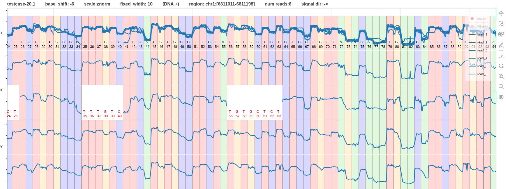
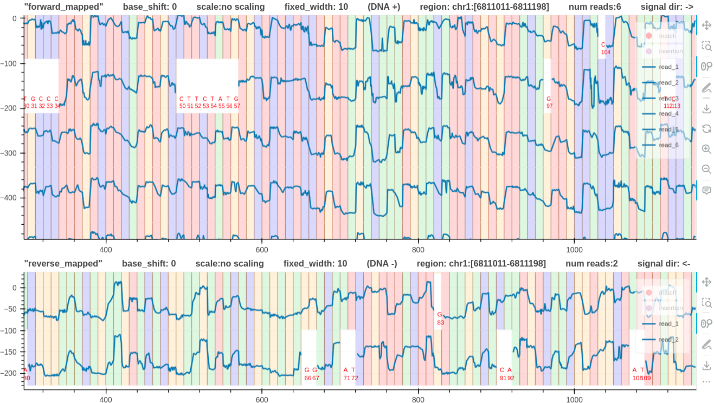

# Base shift calculation

For the basic idea about the base shift please refer [here](https://github.com/hiruna72/squigualiser#base-shift).

Motivated from the idea presented in [pore_model document](pore_model.md) about the most contributing base to the current level, we can programmatically calculate a `base_shift` to nicely align the signal to the base (color).

Provide the argument `--auto_base_shift` to automatically calculate the base shift. 

The calculation is implemented [here](https://github.com/hiruna72/squigualiser/blob/2389379fa8898bf78fd695b3bddac982213ea951/src/plot_utils.py#L194)

## Example 1
* Fig. 1 and 2 have the same `dna_r10.4.1_e8.2_400bps` signal pileup with a base shift of `0` and `-6` respectively.
* The base colors in Fig. 1 is not nicely aligned to the signal. 
* Fig. 2 has the signal moving from low to high when a base `T` is met.
* This is a base shift adjusted plot. Its base shift is `-6` (first 6 bases are not aligned to the signal).
* The reason Fig. 2 aligns well when the base shift is `-6` can be explained further understanding the pileup. This signal pileup is generated usinng f5c eventalign. How to use f5c eventalign is explained [here](https://github.com/hiruna72/squigualiser#option-2-f5c-eventalign).
* F5c uses the `dna_r10.4.1_e8.2_400bps` pore model to align the signals. As discussed in [pore_model document](pore_model.md) the most contributing base index is `-6`.

*Figure 1: base shift 0 [link](https://hiruna72.github.io/squigualiser/docs/figures/pileup/pileup_testcase-20.8.html)*

*Figure 2: base shift -6 [link](https://hiruna72.github.io/squigualiser/docs/figures/pileup/pileup_testcase-20.1.html)*

## Example 2
* Consider a `dna_r10.4.1_e8.2_400bps` forward and reverse mapped pileups for the same genomic region.
* Fig.3 has `0` base shift for both tracks.
* In Fig. 4, note that the reverse mapped pileup has a `-2` base shift. This is because the signal sequencing direction is from right to left.
* In Fig. 4, both pileups have the signals going from low to high when a base `T` is met. 

*Figure 3: base shift 0, 0 [link](https://hiruna72.github.io/squigualiser/docs/figures/plot_tracks/plot_tracks_testcase-30.3.html)*

*Figure 4: base shift -6, -2 [link](https://hiruna72.github.io/squigualiser/docs/figures/plot_tracks/plot_tracks_testcase-30.6.html)*
)

## Example 3
dna_r9.4.1_450bps

## Example 4
rna_r9.4.1_70bps