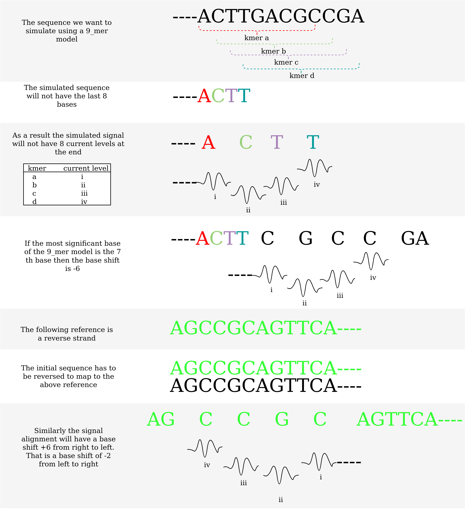

# Base shift of a reverse mapped read

As discussed in [pore_model document](pore_model.md), [base shift calculation document](base_shift_and_eventalignment.md) and [real vs simulated signal dcoument](real_vs_simulated_signal.md) plots that have eventalignment or simulated signals should use a proper base shift.
However, as discussed in [finding the correct kmer_length and sig_move_offset](calculate_kmer_length_sig_move_offset.md) the realign plots can have the base shift to be 0.

What is the proper base shift to be used for reverse mapped reads to color adjust the bases to the signal?

If the plots were generated using `realign` followed by `reform` then the base shift is 0.
However, if the alignment was generated using `f5c eventalignment` or simulated using `squigulator` it is necessary to use the correct base shift.

The following figure illustrates the phenomenon when a read is aligned to the reverse strand of a reference.

The following table lists the proper base shift for reverse mapped reads.
The user can simply provide the correct profile using `--profile` argument ([explained here](profiles.md)) and the base shift will be automatically handled. 

| Chemistry               | kmer size | base shift forward mapping | base shift reverse mapping | Link to the model                                                                                                                                    |
|-------------------------|-----------|----------------------------|----------------------------|------------------------------------------------------------------------------------------------------------------------------------------------------|
| dna_r9.4.1_450bps       |     5_mer | -2                         | -2                         | [r9.4_450bps.nucleotide.5mer.template.model](https://github.com/jts/nanopolish/blob/master/etc/r9-models/r9.4_450bps.nucleotide.5mer.template.model) |
| dna_r9.4.1_450bps       |     6_mer | -2                         | -3                         | [r9.4_450bps.nucleotide.6mer.template.model](https://github.com/jts/nanopolish/blob/master/etc/r9-models/r9.4_450bps.nucleotide.6mer.template.model) |
| rna_r9.4.1_70bps        |     5_mer | -3                         | -1                         | [r9.4_70bps.u_to_t_rna.5mer.template.model](https://github.com/jts/nanopolish/blob/master/etc/r9-models/r9.4_70bps.u_to_t_rna.5mer.template.model)   |
| dna_r10.4.1_e8.2_400bps |     9_mer | -6                         | -2                         | [dna_r10.4.1_e8.2_400bps/9mer_levels_v1.txt](https://github.com/nanoporetech/kmer_models/blob/master/dna_r10.4.1_e8.2_400bps/9mer_levels_v1.txt)     |