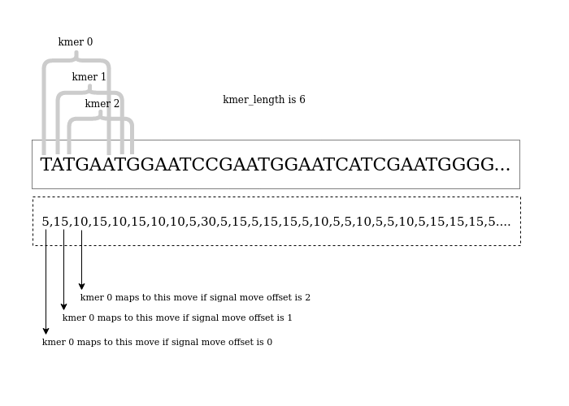

# Calculating base shift

As discussed in [pore model](pore_model.md) and [base shift and event alignment](base_shift_and_eventalignment.md) a base shift must be calculated to properly adjust the base color to the raw signal movements.
If the user is planning to use `reform` for a profile that is not listed then he may also use `calculate_offsets.py` to calculate appropriate kmer lenght and signal move offset value to use in the `refom` command.

## Option 1
To calculate the kmer length  and signal move offset for a dataset to use in `reform` use the following command.
```
python calculate_offsets.py -p reform.paf -s reads.blow5 -f reads.fastq
```

## Option 2
To calculate the kmer length  and signal move offset for a specific read and visualise the best base shift use the following command.
```
python calculate_offsets.py -p reform.paf -s reads.blow5 -f reads.fastq -o out.pdf --read_id ${READ_ID} 
```

## Option 3
To calculate and visualise the best base shift for a kmer model use the following command.
```
python calculate_offsets.py --use_model --model pore.model -o out.pdf 
```

The [table](reform.md/#precomputed-kmer-lengths-and-signal-moves-offsets) listing the profiles, recommended kmer lengths and the signal move offsets was calculated using [Option 1](#option-1)

The density plots documented in [pore model](pore_model.md) were calculated using [Option 3](#option-3)

The following density plots were generated using [Option 2](#option-2) for a specific read to find the most significant base offset.

| profile                            | denisty plot file                                                                              |
|------------------------------------|------------------------------------------------------------------------------------------------|
| guppy_dna_r9.4.1_450bps_fast_prom  |  [pdf](density_plots/8e1a33c4-af69-471c-a115-6428c8bf63df_dna_r9.4.1_450bps_fast_prom.cfg.pdf) |
| guppy_dna_r9.4.1_450bps_hac_prom   |   [pdf](density_plots/8e1a33c4-af69-471c-a115-6428c8bf63df_dna_r9.4.1_450bps_hac_prom.cfg.pdf) |
| guppy_dna_r9.4.1_450bps_sup_prom   |   [pdf](density_plots/8e1a33c4-af69-471c-a115-6428c8bf63df_dna_r9.4.1_450bps_sup_prom.cfg.pdf) |
| guppy_dna_r10.4.1_e8.2_400bps_fast | [pdf](density_plots/35142bde-548d-4f55-bf50-21c4cdd254da_dna_r10.4.1_e8.2_400bps_fast.cfg.pdf) |
| guppy_dna_r10.4.1_e8.2_400bps_hac  |  [pdf](density_plots/35142bde-548d-4f55-bf50-21c4cdd254da_dna_r10.4.1_e8.2_400bps_hac.cfg.pdf) |
| guppy_dna_r10.4.1_e8.2_400bps_sup  |  [pdf](density_plots/35142bde-548d-4f55-bf50-21c4cdd254da_dna_r10.4.1_e8.2_400bps_sup.cfg.pdf) |

The following pseudo code should help in understanding how the most significant base index is determined in [Option 3](#option-3)
````
finding_the_most_significant_base(){
    for base_index_i in kmer_length:
        assume base_index_i is the most significant base
        for kmer, current_level in kmer_model:
            bin current_level to one of the four bins A,C,G and T. 
            The bin is chosen looking at the base_index_i position of the kmer.
        draw four density plots one each for base in a subplot
        
    The differences between maximum and the minimum medians for each base index is calculated.
    The maximum difference (max_diff) is taken as the maximum distance and the corresponding base index (base_idx) is considered the significant base index.
    return  max_diff, base_idx
}
````

The below figure and the pseudo code should help in understanding how the best kmer_length and sig_move_offset values are determined in [Option 1](#option-1)
````
DEFAULT_KMER_LENGTH = 6
best_m = 0
best_max_diff = -infinity
most_significant_base_index = 0
recommended_sig_move_offset = 0
for m in range(0,DEFAULT_KMER_LENGTH):
    create a (partial) kmer model by iterating the fastq sequence while assigning each kmer in the sequence a current value that corresponds to the level pointed by the move.
    local_max_diff, base_idx = finding_the_most_significant_base() (pass the kmer model to the finding_the_most_significant_base() as described above)
    if best_max_diff < local_max_diff:
        best_max_diff = local_max_diff
        best_m = m
        most_significant_base_offset = base_idx
        if most_significant_base_offset == 0:
            recommended_sig_move_offset = m (assumption - the recommended_sig_move_offset is the m value where the most_significant_base_offset is zero and as we increment m value by 1 also most_significant_base_offset is also incremented by 1)

confirm that the assumption is valid by checking...
if recommended_sig_move_offset == best_m - most_significant_base_offset
    then recommended_kmer_length = recommended_sig_move_offset + 1
else further analyse the density plots generated.
````



The assumption mentioned in the pseduo code has been valid for all `guppy_dna_r9.4.1_450bps_fast_prom, guppy_dna_r9.4.1_450bps_hac_prom, guppy_dna_r9.4.1_450bps_sup_prom, guppy_dna_r10.4.1_e8.2_400bps_fast, guppy_dna_r10.4.1_e8.2_400bps_hac, guppy_dna_r10.4.1_e8.2_400bps_sup` models.

For example the density plots for `guppy_dna_r9.4.1_450bps_fast_prom` found [here](density_plots/8e1a33c4-af69-471c-a115-6428c8bf63df_dna_r9.4.1_450bps_fast_prom.cfg.pdf) are summarised in the table below.

| Plot number | Observation                                 | sig_move_offset   | best_base_offset | max_distance |
|-------------|---------------------------------------------|-------------------|------------------|--------------|
| 1           | no clear separation among the density plots | 0                 | 0                | 14.2552      |
| 2           | no clear separation among the density plots | 1                 | 0                | 13.1586      |
| 3           | a clear separation in the first subplot     | 2                 | 0                | 20.1948      |
| 4           | a clear separation in the second subplot    | 3                 | 1                | 20.469       |
| 5           | a clear separation in the third subplot     | 4                 | 2                | 20.469       |
| 6           | a clear separation in the fourth subplot    | 5                 | 3                | 21.7483      |

The first two plots show that the first two moves in the move array are not relevant.
However, starting from the third plot we see a clear separation and the separation continues to shift by 1 as we increment the `sig_move_offset`.
So we pick the `sig_move_offset` for which we first observe the clear separation `(sig_move_offset = 2)`.
Even though `max_distance` is `21.7483` and corresponds to `sig_move_offset = 5`; since `(2 == 5 - 3)`, we have picked the correct value.