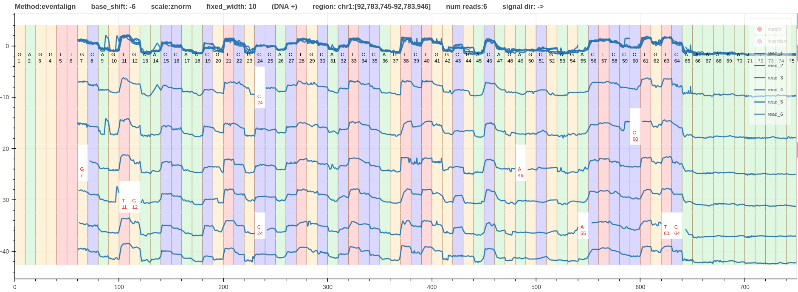

# Different Alignments

Here we will look at the 3 different signal alignment methods for the same `dna_r10.4.1_e8.2_400bps` signals that align to the region `chr1:92,783,745-92,783,946`.
1. Fig.1 - Alignment using [realign method](realign.md)
2. Fig.2 - Alignment using f5c eventalign method
3. Fig.3 - Alignment using [nanopolish signal projection method](https://github.com/hiruna72/nanopolish/tree/r10.4-integration). This is a dynamic programming based algorithm that uses the [move table](move_table.md) as a guide to generate the alignment.
4. Fig. 4 - Squigulator signal simulation

*Figure 1: Alignment using [realign method](realign.md) [link](https://hiruna72.github.io/squigualiser/docs/figures/different_aligments/dna_r10.4.1_e8.2_400bps_sup.cfg_realigned_vs_sim.html)*

*Figure 2: Alignment using f5c eventalign method [link](https://hiruna72.github.io/squigualiser/docs/figures/different_aligments/dna_r10.4.1_e8.2_400bps_sup.cfg_evligned_vs_sim.html)*

*Figure 3: Alignment using [nanopolish signal projection method](https://github.com/hiruna72/nanopolish/tree/r10.4-integration). [link](https://hiruna72.github.io/squigualiser/docs/figures/different_aligments/dna_r10.4.1_e8.2_400bps_sup.cfg_nanopolish_projected_vs_sim.html)*

*Figure 4: Squigulator signal simulation*

These alignments can be compared against each other visually and statistically.
When the alignment methods are ranked based on the quality of aligning ups and downs of the signal to the moves (refined boundaries); f5c eventalign is at the top with very well refined boundaries followed by nanopolish signal projection.
Due to the inherent limitation in move table realign has the worst refined boundaries.
Considering the distortion introduced to the shape of the signal; nanopolish signal projection has the highest distortion level where some kmers have 1 sample move that created straight lines (see `G41-G50`).
Overall, f5c eventalign is the best alignment method in this case.

Sub-tool `metric` can be used to infer some basic statistics of the alignments. The output format is explained [here](metric.md).
The statistics generated for each alignment can be found [here](figures/different_aligments/metric).
The minimum number of samples for a move is 1 for nanopolish signal projection and 3 for the other two alignments.
The mode value of number of samples for a move is also 1 for the nanopolish signal projection.
This explains the distortion associated with nanopolish signal projection alignment described above.
