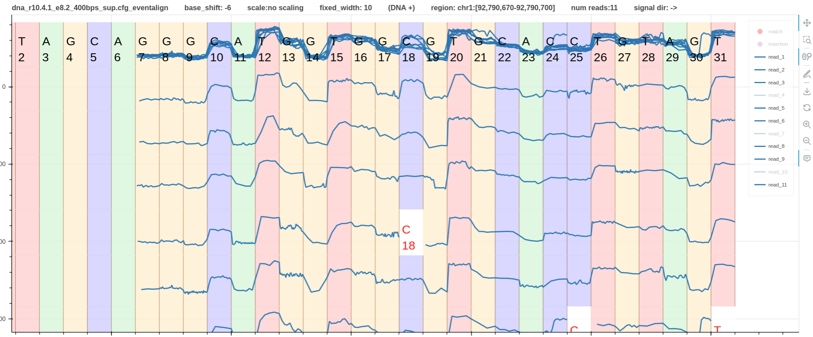

# Pipeline methylation detection DNA

In this example three cpg methylations are found in humangenome hg38.fa in the region `chr1:92,779,392-92,779,445`.
This is the same region that we used in the [variant calling pipeline](pipeline_variant_detection_real.md)

Fig. 1 shows a screenshot of IGV.
The first track is the bam file containing alignment track.
The second track is the high confidence variants vcf file (`subset.vcf.gz`).
The third track is the methylated cpg sites based on `f5c methylation-call` tool (`meth_freq.bigwig`).
The last track shows the aligned reads.
Methylated cites are present at `chr1:92,779,423`, `chr1:92,779,428`, and `chr1:92,779,436`.

*Figure 1*

The pipeline data is at `test/data/raw/pipelines/pipeline_2/dna_r10.4.1_e8.2_400bps`.

Note that the pipeline must be executed inside the virtual environment where squigualiser is installed.
The bash script `run.sh` is very similar to the pipeline explained [here](pipeline_basic.md).

Fig.2 shows two tracks. The first is the reference to signal alignment using `eventalign`.
The second is the reference simulated signal.
The blue color boxes in the first track annotate the methylated cites as shown on IGV track.
The real signal plot clearly shows two different current levels at methylated cites.

*Figure 2*

## Using methylation frequency information

Optionally, we can use the methylation frequency information to better visualise the methylations.
1. Filter a site from the methylation frequency `meth-freq.tsv` file where the frequency is approximately `0.5`.
2. Filter the `+` reads of the filtered site from the raw `meth.tsv` file.
3. Filter the read ids where the log likelihood ratio is less than `-2` and above `2` for unmethylated and methylated reads respectively.
4. Use the filtered read ids to create a pileup plot.

In the following example we considered the `+` strand reads covering the site `chr1:92790686` with a methylation frequency of `0.542`.
As shown in the overlap plot in Fig.3 the site `C18` has two distinct current levels.
The higher current level corresponds with the unmethylated sites/read_ids.
The lower current level corresponds with the methylated sites/read_ids.
Out of the 11 total reads in the pileup, 3 have deletions at the site, 3 are unmethylated, and 5 are methylated (Table 1).

*Figure 3*

*Table 1*

| chromosome | strand | start    | end      | read_name                            | log_lik_ratio | log_lik_methylated | log_lik_unmethylated | num_calling_strands | num_motifs |
|------------|--------|----------|----------|--------------------------------------|---------------|--------------------|----------------------|---------------------|------------|
| chr1       | +      | 92790686 | 92790686 | 1e12424f-dcab-4cd0-83c3-79afc1326199 | -4.41         | -120.27            | -115.86              | 1                   | 1          |
| chr1       | +      | 92790686 | 92790686 | 6b960395-8f61-4b8f-880d-e1852a5556a8 | -2.78         | -147.48            | -144.7               | 1                   | 1          |
| chr1       | +      | 92790686 | 92790686 | d2d2c018-f49f-436b-a038-e441f95a49ad | -2.69         | -162.08            | -159.39              | 1                   | 1          |
|            |        |          |          |                                      |               |                    |                      |                     |            |
| chr1       | +      | 92790686 | 92790686 | fdb21051-2388-446d-acf2-a6848669ced8 | 2.62          | -84.27             | -86.89               | 1                   | 1          |
| chr1       | +      | 92790686 | 92790686 | caad6a89-8ad5-485d-9ed9-903e99ed1b6a | 3.8           | -196.16            | -199.95              | 1                   | 1          |
| chr1       | +      | 92790686 | 92790686 | 362dc957-024e-4c56-a26a-c7fe4cd07304 | 4.15          | -198.4             | -202.56              | 1                   | 1          |
| chr1       | +      | 92790686 | 92790686 | 5ae057b3-cde0-4248-a905-d18a75079ba2 | 4.6           | -127.22            | -131.82              | 1                   | 1          |
| chr1       | +      | 92790686 | 92790686 | 0aa2c317-d8c4-4861-ac6f-87bab7fff2d8 | 4.77          | -134.04            | -138.81              | 1                   | 1          |
| chr1       | +      | 92790686 | 92790686 | b23eadb5-9f1f-454b-82c9-1d86b0d6faf8 | 5.39          | -106.46            | -111.84              | 1                   | 1          |
| chr1       | +      | 92790686 | 92790686 | 9efe2d41-af4e-4b6c-9f20-48e971ac06b3 | 5.54          | -117.49            | -123.03              | 1                   | 1          |
| chr1       | +      | 92790686 | 92790686 | 97953cda-3ab0-4f1f-9e6a-47a04e75bf0a | 5.86          | -125.13            | -130.99              | 1                   | 1          |

The plot is available [here](figures/methylation/dna_r10.4.1_e8.2_400bps_sup.cfg_evligned_vs_sim.html).