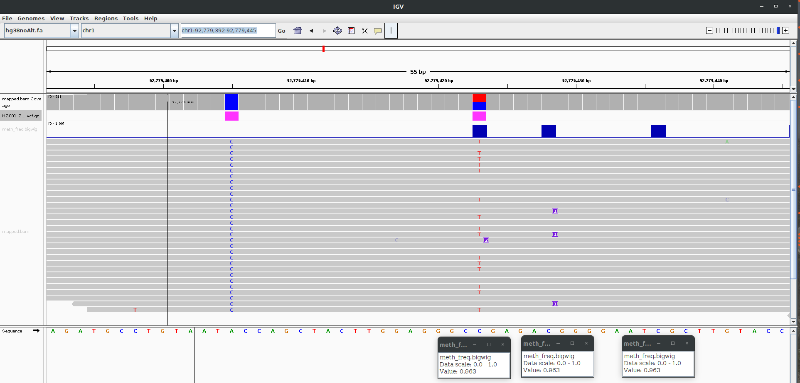
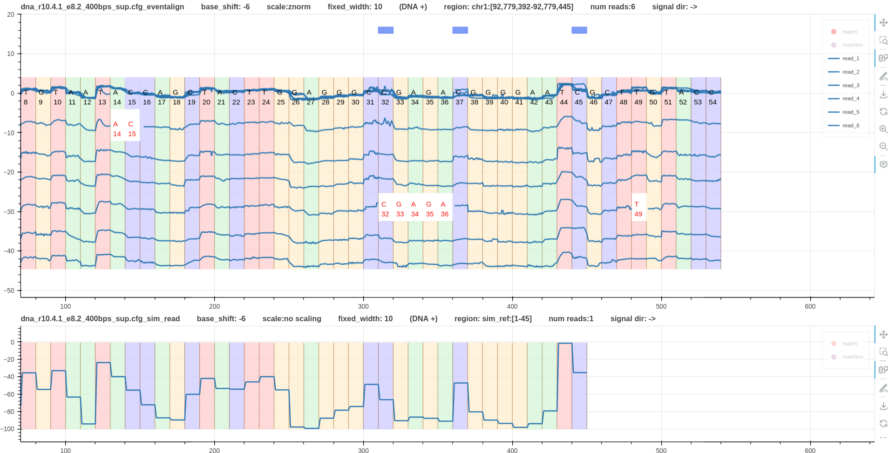

# Pipeline methylation detection DNA

## A real variant

In this example three cpg methylations are found in humangenome hg38.fa in the region `chr1:92,779,392-92,779,445`.
This is the same region that we used in the [variant calling pipeline](pipeline_variant_detection_real.md)

Fig. 1 shows a screenshot of IGV.
The first track is the bam file containing alignment track.
The second track is the high confidence variants vcf file (`subset.vcf.gz`).
The third track is the methylated cpg sites based on `f5c methylation-call` tool (`meth_freq.bigwig`).
The last track shows the aligned reads.
Methylated cites are present at chr1:92,779,423, chr1:92,779,428, and chr1:92,779,436.

*Figure 1*

The pipeline data is at `test/data/raw/pipelines/pipeline_2/real_variant/dna_r10.4.1_e8.2_400bps`.

Note that the pipeline must be executed inside the virtual environment where squigualiser is installed.
The bash script `run.sh` is very similar to the pipeline explained [here](pipeline_basic.md).

Fig.2 shows two tracks. The first is the reference to signal alignment using `eventalign`.
The second is the reference simulated signal.
The blue color boxes in the first track annotate the methylated cites as shown on IGV track.
The real signal plot clearly shows two different current levels at methylated cites.

*Figure 2*

