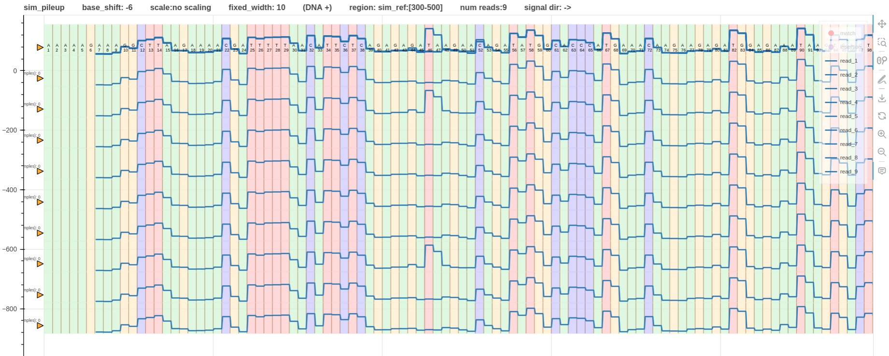
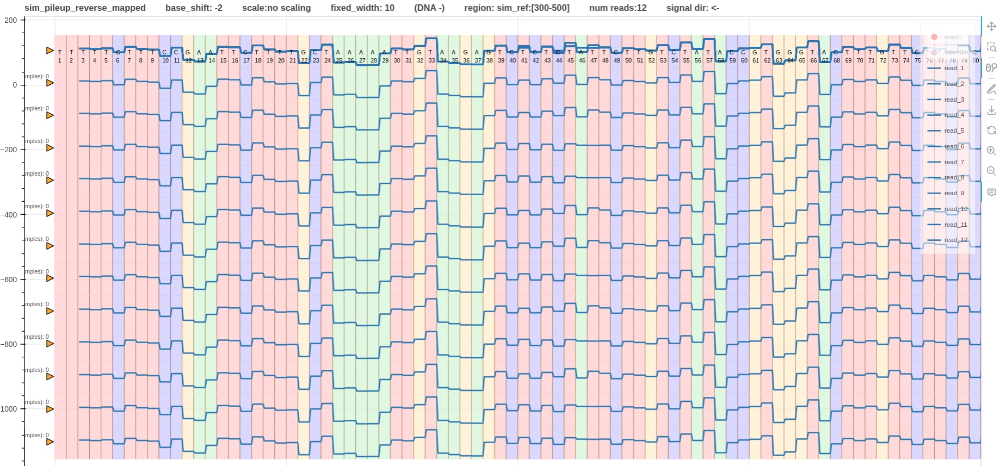

# Pipeline variant detection

## A simulated variant

In this example let's look at an artificially added variant to a simulated raw signal.

We simulated two sets of reads from two reference genomes. The only difference between the two genomes is a single SNV at 346th base.
One has `T`; the other has `A`.
The pipeline data is at `test/data/raw/pipelines/pipeline_1/simulated`.
Note that the script must be executed inside the virtual environment where squigualiser is installed.

The following variables must be changed before running the bash script.

| **Variable name**               | **Description**                                                                                                                                                                                                      | **value set for this pipeline**          |
|---------------------------------|----------------------------------------------------------------------------------------------------------------------------------------------------------------------------------------------------------------------|------------------------------------------|
| SQUIGULATOR                     | path to squigulator                                                                                                                                                                                                  | -                                        |
| SAMTOOLS                        | path to samtools                                                                                                                                                                                                     | -                                        |
| SLOW5TOOLS                      | path to slow5tools                                                                                                                                                                                                   | -                                        |
| SIMULATING_PROFILE              | signal profile used by squigulator (-x argument)                                                                                                                                                                     | dna-r10-prom                             |
| PROFILE_TO_DETERMINE_BASE_SHIFT | `squigualiser` uses this value to determine the appropriate `base_shift`. More details can be found at [profiles](profiles.md)                                                                                       | kmer_model_dna_r10.4.1_e8.2_400bps_9_mer |
| SIM_REGION                      | (optional) The region to plot in simulated read and the reference.                                                                                                                                                   | sim_ref:300-500                          |

In the bash script `run.sh` two signal files are simulated one for each genome. Then the two signal files and the alignment SAM files are merged separately before generating a pileup.
Fig. 1 shows the pileup of the forward mapped reads. At base index 46, the second and the seventh read have `T` and the rest have `A`. This can be easily seen in the overlap plot at the top.
Fig. 2 shows the pileup of the reverse mapped reads. However, it is not very noticeable as in the forward pileup.

*Figure 1*

*Figure 2*

