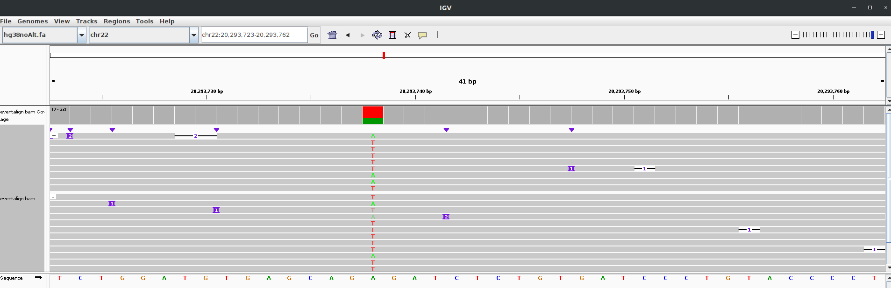
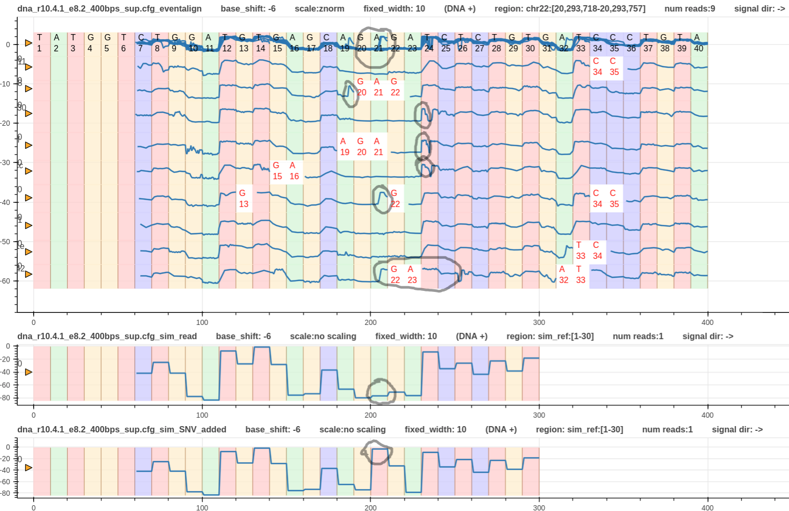
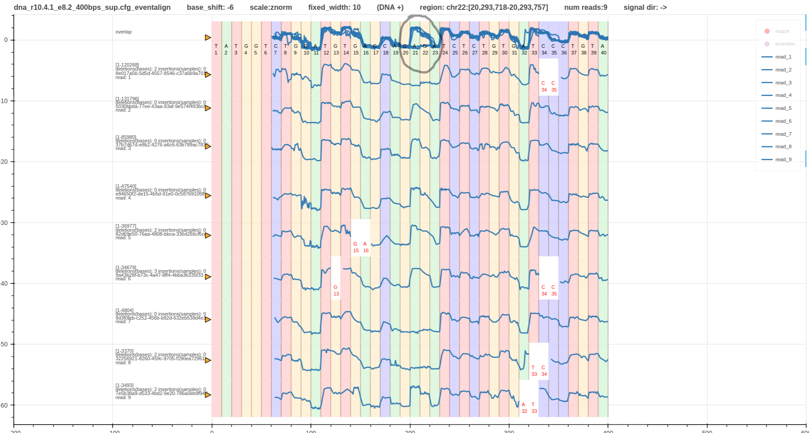

# Pipeline variant detection

* In this example let's look at a variant found in humangenome hg38.fa in the region `chr22:20,293,723-20,293,762`.
* Fig. 1 shows a screenshot of IGV.
* The reads are grouped as forward and reverse mapped reads.
* Let's focus only on the forward mapped reads. Read 1,7, and 8 have `A` at site `chr22:20,293,738` while read 2,3,4,5,6, and 9 have `T`.

*Figure 1*

* The signal file required to generate the final plots is at `test/data/raw/pipelines/pipeline_1/real_variant_chr22`.
* The pipeline script discussed [here](pipeline_variant_detection_real.md) can be adopted for this task.

* Fig.2 shows three tracks. The first is the reference to signal alignment using `eventalign`.
* The second is the reference simulated signal.
* The third is the reference with the SNV added simulated signal.
* Grey circles mark the SNV we are interested in.

* As shown in the simulated reads there must be a clear jump up in the signals at `A21` when it is a `T`.
* Eventalign algorithm has aligned this specific jump with the next jump that happens at `T24`.
* This is not correct but expected.
* That is because, the reads were minimap2 aligned to the original reference where an `A` was present, not a `T`. 

*Figure 2*

* The best way to rectify this is by minimap2 aligning the reads again to a reference where the particular `A` is replaced with a `T`.
* Then run `f5c evenalign` again with the new alignment file and the new reference.
* Grab the records for read 1,7, and 8 from the previous `eventalign` output.
* Grab the records for read 2,3,4,5,6, and 9 from the new `eventalign` output.
* Merge the records to a single alignment file and use it to create a new pileup plot as shown in Fig. 3.
* This gives a better visualisation. 

*Figure 3*

The plot can be found [here](figures/variants/chr22/dna_r10.4.1_e8.2_400bps_sup.cfg_evligned_merged_chr22:20,293,718-20,293,757.html)   