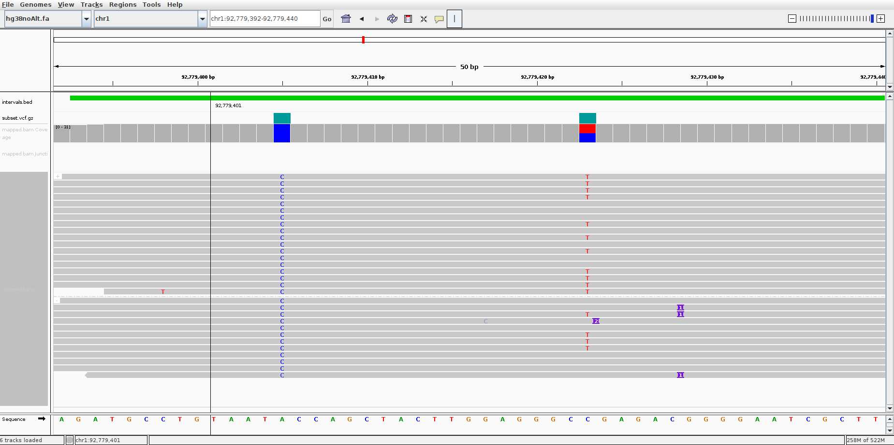
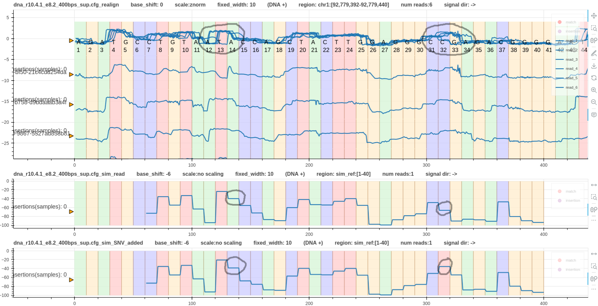
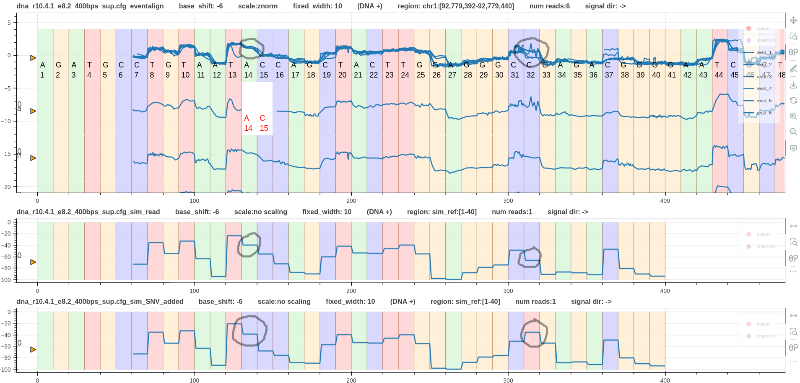
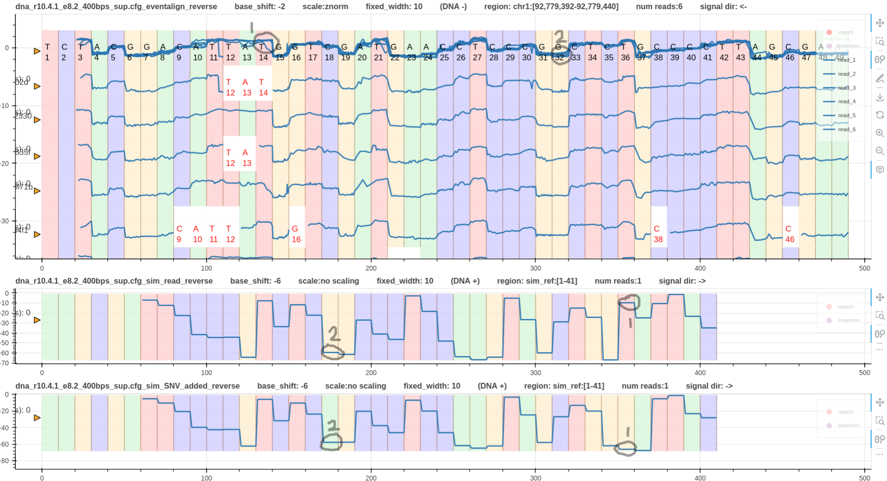
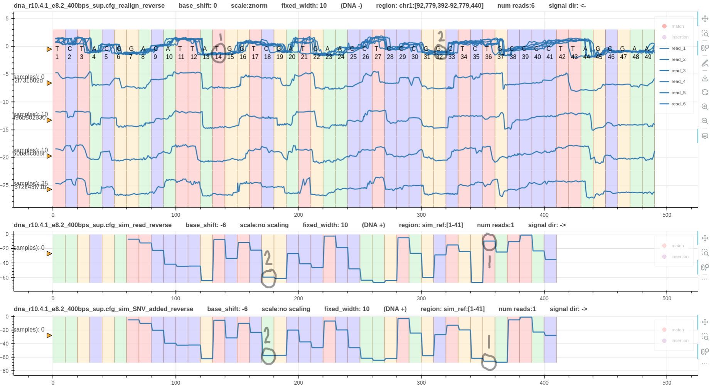
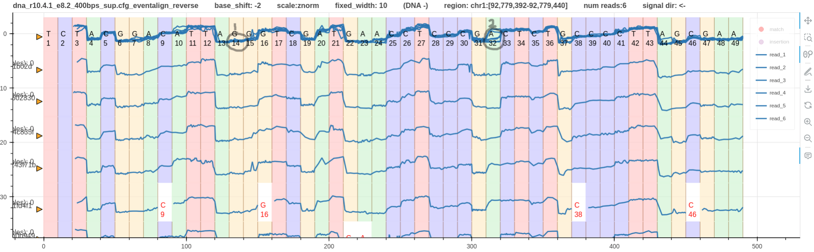

# Pipeline variant detection

## A real variant

In this example let's look at two variants found in humangenome hg38.fa in the region `chr1:92,779,392-92,779,440`.

Fig. 1 shows a screenshot of IGV.
The first long green track is a bed file that annotates the high confidence variant regions (`intervals.bed`).
The second track is the high confidence variants vcf file (`subset.vcf.gz`).
The third track is the bam file containing alignment track.
The last track shows the aligned reads grouped as forward and reverse mapped reads.
The first SNV occurs at chr1:92,779,405. The reference has `A` and all the reads have `C`.
The second SNV occurs at chr1:92,779,423. Some reads have `T` while the reference has `C`.

*Figure 1*

The pipeline data is at `test/data/raw/pipelines/pipeline_1/real_variant`.

Note that the script must be executed inside the virtual environment where squigualiser is installed.

The bash script `run.sh` is very similar to the pipeline explained [here](pipeline_basic.md).
In addition to simulating the reference we also simulate the reference with the two SNVs (`ref_SNV_added.fasta`).

Fig.2 shows three tracks. The first is the reference to signal alignment using `realign`.
The second is the reference simulated signal.
The third is the reference with the two SNVs added simulated signal.
Grey circles mark the SNVs we are interested in.
There is no clear difference in the shape for the first SNV between the simulated signals.
However, the drop from `A` to `C` (second track) is smaller than the drop from `C` to `C` (third track).
The second SNV shows a clear difference where `C` to `C` (second track) drops while `C` to `T` (third track) jumps up.
Note that the realigned plot does not have refined events.
Hence, it is difficult to observe the above phenomena in the real signals. 

*Figure 2*

Fig. 3 has the `eventalign` alignment instead of the `realign` alignment.
This is a more clean alignment and allows to clearly observe the SNVs in the signal domain.
Since the fist SNV is available in all reads a difference in the shapes among the signals cannot be observed.
However, when compared to the simulated signal the real signals are different.
This confirms the presence of the fist SNV.
The second SNV has caused some signals to jump up while the rest drops down.
The reads that jump up correspond with the SNV and this can be confirmed with the read pileup on IGV.

*Figure 3*

Apart from the signal variations observed at the two SNVs, there are couple more variations.
One is at base `C37`. This might be a methylation. 
The other is at base `C45`. This could also be a methylation or an error in the `eventalign` tool.
`Squigualiser` makes it possible to closely study these regions of interest that could uncover new information.
Actually, after executing the [methylation detection pipeline](pipeline_methylation_detection_DNA.md) we found that these are methylated cites (including the `C` at SNV 2).

Fig. 4 & 5 illustrate reverse mapped reads aligned using `eventalign` and `realign` respectively.
Looking at the simulated signals, it is evident that SNV 2 does not affect the signal shape.
Hence, the signal shapes at SNV 2 on the reverse strand are almost similar making it difficult to visualise SNV 2 on reverse strand.
In contrast, SNV 1 has caused the signal shape to be very different between the two simulated signals.
Hence, this should be obvious in the real signals as well. However, it is not visible on `eventalign` alignment in Fig. 4.
The reason is that `eventalign` has pulled forward (sequencing direction is from right to left) the true signal jump that happens at `T12` to `T14`.
However, `realign` does not refine move boundaries. Hence, SNV 1 is visible on `realign` alignment in Fig. 5.
Given that `f5c eventalign` tries its best to align the signal to the reference the above observation is sensible.
However, to limit such false event annotations at true variants it is good practice to apply the variants to the reference before running `f5c eventalign`. 
Fig. 6 shows how the events are properly aligned at SNV1. In this case a reference with SNV 1 and SNV 2 applied was used for `f5c eventalign`.
Since SNV 2 only appeared in some reads (Fig. 1) the events at SNV 2 is not as good as Fig. 4.
Also note that reference cite `C` at SNV2 is methylated ([methylation detection pipeline](pipeline_methylation_detection_DNA.md)).

*Figure 4*

*Figure 5*

*Figure 6*

