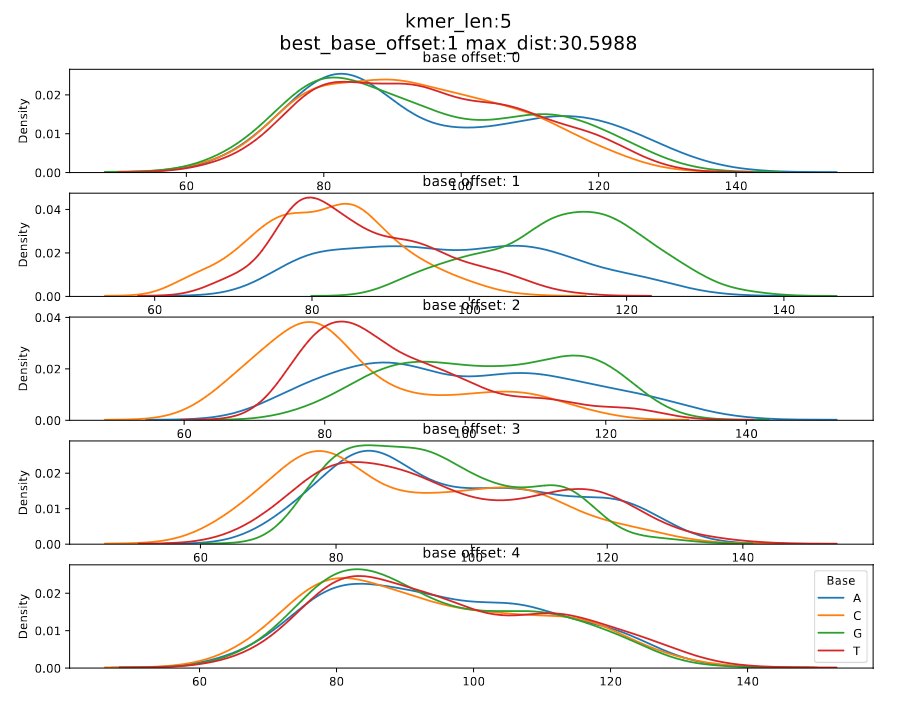

# Pore model

For different nanopore chemistries we have different pore models. These pore models have different kmer lengths, current levels and standard deviations.
[This](https://github.com/nanoporetech/kmer_models) is the official repository to find the pore models.
[Nanopolish](https://github.com/jts/nanopolish) uses pore models to do different signal - read alignments.
[F5c](https://github.com/hasindu2008/f5c) (an improved version of nanopolish) hence, also uses pore models.

At a time, all the bases of the kmer inside the nanopore influence the current/voltage level.

However, not all the bases equally contribute to this phenomenon. 


*Depending on the size of the nanopore the kmer residing inside the pore can vary in length. In addition, depending on how the kmer-model was generated, the most significant base may or may not be the base at the center of the kmer.*

We can find the position of the most contributing base by analysing the degree to which each base in the kmer can separate A, C, G, and T/U.

| Chemistry               | kmer size | Figure no | Significant base index (0 based) | Link to the model                                                                                                                                    |
|-------------------------|-----------|-----------|----------------------------------|------------------------------------------------------------------------------------------------------------------------------------------------------|
| dna_r9.4.1_450bps       | 5_mer     | 1         | 2                                | [r9.4_450bps.nucleotide.5mer.template.model](https://github.com/jts/nanopolish/blob/master/etc/r9-models/r9.4_450bps.nucleotide.5mer.template.model) |
| dna_r9.4.1_450bps       | 6_mer     | 2         | 2                                | [r9.4_450bps.nucleotide.6mer.template.model](https://github.com/jts/nanopolish/blob/master/etc/r9-models/r9.4_450bps.nucleotide.6mer.template.model) |
| rna_r9.4.1_70bps        | 5_mer     | 3         | 1                                | [r9.4_70bps.u_to_t_rna.5mer.template.model](https://github.com/jts/nanopolish/blob/master/etc/r9-models/r9.4_70bps.u_to_t_rna.5mer.template.model)   |
| dna_r10.4.1_e8.2_400bps | 9_mer     | 4         | 6                                | [dna_r10.4.1_e8.2_400bps/9mer_levels_v1.txt](https://github.com/nanoporetech/kmer_models/blob/master/dna_r10.4.1_e8.2_400bps/9mer_levels_v1.txt)     |

Please note that the current values in the `dna_r10.4.1_e8.2_260bps` model above is normalized. It is not necessary to transform the values to pA domain for our analysis. However, one can do the transformation as follows,
````
sigtk pa -n dna_r10.4.1_e8.2_260bps_reads.blow5 | cut -f3 | sed 's/,/\n/g' | datamash mean 1 sstdev 1
pA_value = normalized_value * std + mean
````
sigtk can be found [here](https://github.com/hasindu2008/sigtk)`option 1`


*Figure 1: dna_r9.4.1_450bps_5_mer*


*Figure 2: dna_r9.4.1_450bps_6_mer*



*Figure 3: rna_r9.4.1_70bps_5_mer*


*Figure 4: dna_r10.4.1_e8.2_400bps_9_mer*

In DNA models, looking at the current densities for each nucleotide of the most contributing base index we can see that the median current of a nucleotide is in the order A < C < G < T, i.e., the median current value of T and A are the maximum and minimum respectively.


The code to generate above plots is given below,
If the user want to generate above plots for a new kmer model the following command can be used. More information about this command can be found at [calculate offsets](calculate_offsets.md).

````
python calculate_offsets --use_model --model ${MODEL_PATH} -o ${OUTPUT_PDF_PATH}
````
The following is a pseudo code for plotting density plots
````
for base_index in kmer_length:
    assume base index is the most significant base
    bin current values to four bins A,C,G and T
    draw four density plots each for base
````

The differences between maximum and the minimum medians for each base index is calculated.
The maximum difference is taken as the maximum distance and the corresponding base index is considered the significant base index. 