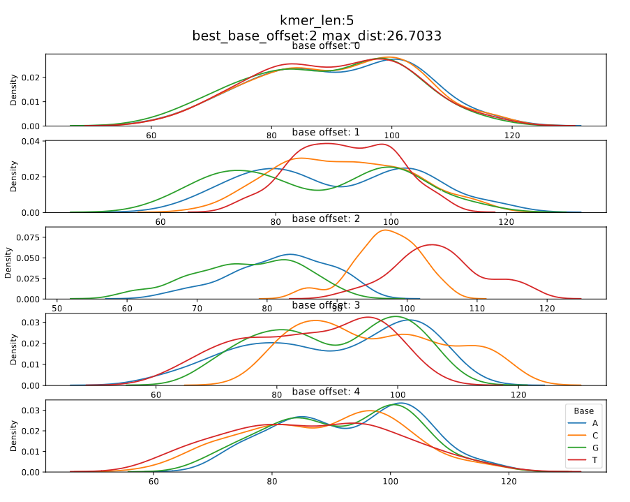

# Pore model

For different nanopore chemistries we have different pore models. These pore models have different kmer lengths, current levels and standard deviations.
[This](https://github.com/nanoporetech/kmer_models) is the official repository to find the pore models.
[Nanopolish](https://github.com/jts/nanopolish) uses pore models to do different signal - read alignments.
[F5c](https://github.com/hasindu2008/f5c) (an improved version of nanopolish) hence, also uses pore models.

At a time, all the bases of the kmer inside the nanopore influence the current/voltage level.

However, not all the bases equally contribute to this phenomenon. 

We can find the position of the most contributing base by analysing the degree to which each base in the kmer can separate A, C, G, and T/U.

| Chemistry               | kmer size | Figure no | Significant base index (0 based) | Link to the model                                                                                      |
|-------------------------|-----------|-----------|----------------------------------|--------------------------------------------------------------------------------------------------------|
| dna_r9.4.1_450bps       | 5_mer     | 1         | 2                                | https://github.com/jts/nanopolish/blob/master/etc/r9-models/r9.4_450bps.nucleotide.6mer.template.model |
| dna_r9.4.1_450bps       | 6_mer     | 2         | 2                                | https://github.com/jts/nanopolish/blob/master/etc/r9-models/r9.4_450bps.nucleotide.6mer.template.model |
| rna_r9.4.1_70bps        | 5_mer     | 3         | 1                                | https://github.com/jts/nanopolish/blob/master/etc/r9-models/r9.4_70bps.u_to_t_rna.5mer.template.model  |
| dna_r10.4.1_e8.2_400bps | 9_mer     | 4         | 6                                | https://github.com/nanoporetech/kmer_models/blob/master/dna_r10.4.1_e8.2_400bps/9mer_levels_v1.txt     |

Please note that the current values in the `dna_r10.4.1_e8.2_260bps` model above is normalized. It is not necessary to transform the values to pA domain for our analysis. However, one can do the transformation as follows,
````
sigtk pa -n dna_r10.4.1_e8.2_260bps_reads.blow5 | cut -f3 | sed 's/,/\n/g' | datamash mean 1 sstdev 1
pA_value = normalized_value * std + mean
````
sigtk can be found [here](https://github.com/hasindu2008/sigtk)


*Figure 1: dna_r9.4.1_450bps_5_mer*


*Figure 2: dna_r9.4.1_450bps_6_mer*


*Figure 3: rna_r9.4.1_70bps_5_mer*


*Figure 4: dna_r10.4.1_e8.2_400bps_9_mer*

The code to generate above plots is given below,
````
import matplotlib.pyplot as plt
import seaborn as sns

BASE_INDEX = {'A': 0, 'C': 1, 'G': 2, 'T': 3, 'U': 3,}
BASE_MAP = {0: 'A', 1: 'C', 2: 'G', 3: 'T'}

def calculate_offset_values(model_file, header_line_count, kmer_length=0):
    model = {}
    with open(model_file) as f:
        obj = [line.rstrip('\n') for line in f]
        if kmer_length == 0:
            kmer_length = int(obj[3].split('\t')[1])
        model_ = obj[header_line_count:]
        for line in model_:
            values_ = line.split('\t')
            model[values_[0]] = float(values_[1])
    print(kmer_length)
    test_array = []
    for offset in range(0, kmer_length):
        freq = [[], [], [], []]
        for kmer, value in model.items():
            freq[BASE_INDEX[kmer[offset]]].append(value)
        test_array.append(freq)
    return test_array, kmer_length

test_array, kmer_length = calculate_offset_values(model_file, header_line_count)
f, axes = plt.subplots(nrows=kmer_length, ncols=1, figsize=(12,9))
for offset in range (0, kmer_length):
    i = 0
    for base in test_array[offset]:
        sns.distplot(base, bins = 10, label = BASE_MAP[i], hist = False, kde = True, norm_hist=False, kde_kws = {'shade': True, 'linewidth': 3}, hist_kws = {'edgecolor': 'black'}, ax=axes[offset])
        i += 1
    axes[offset].set_title('base: {}'.format(offset))
    
plt.legend(prop={'size': 10}, title = 'Base')

````