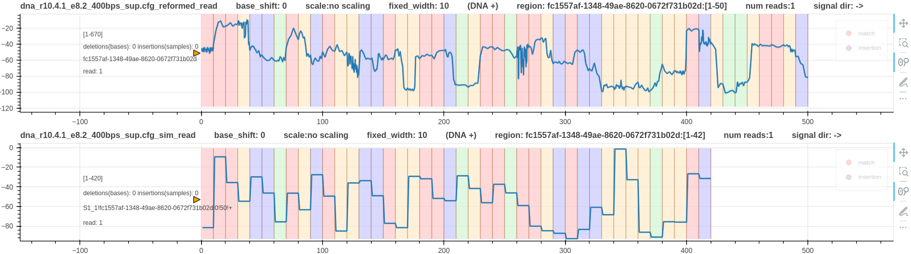
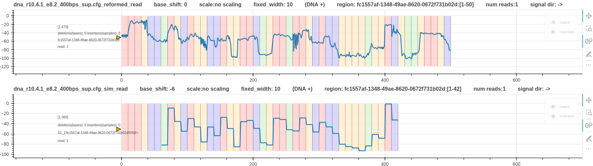

# Real vs simulated signal

We observed that for different chemistry the simulated signal and the real signal do not align right off the bat. 
This is expected as the simulated signal only has `n - k + 1` number of bases (signal levels). 
`n` is the number of bases in the original read.
`k` is kmer length of the model used to simulate the read.
To align it to the real signal a base shift must be used as discussed in [pore_model document](pore_model.md).

Consider the following example.

*Figure 1: A real r10 DNA signal vs its simulated signal*

In the above Figure, two things can be noted.
1. Simulated signal has 8 bases less than the real signal.
2. The two signals don't align each other.

The pore model used for the simulation is a 9_mer model (`n=50, k=9`). Hence, the simulated signal length is `50-9+1=42` bases.
The appropriate base shift is `-6` as discussed for r10 DNA chemistry ([pore_model document](pore_model.md)).
The real signal does not require a base shift (`--base_shift 0`). The reason for that discussed in [finding the correct kmer_length and sig_move_offset](calculate_kmer_length_sig_move_offset.md)

Following is a base shift corrected plot. It is expected to lose the last 6 current levels once this correction is performed. Ideally, the last 6 current levels be drawn by adding the next six bases to the simulated signal. 
However, the `paf` or `sam` alignment output generated by squigulator has the alignment region to be `42` bases as explained above.

*Figure 1: A real r10 DNA signal vs its simulated signal (base shift -6)*
