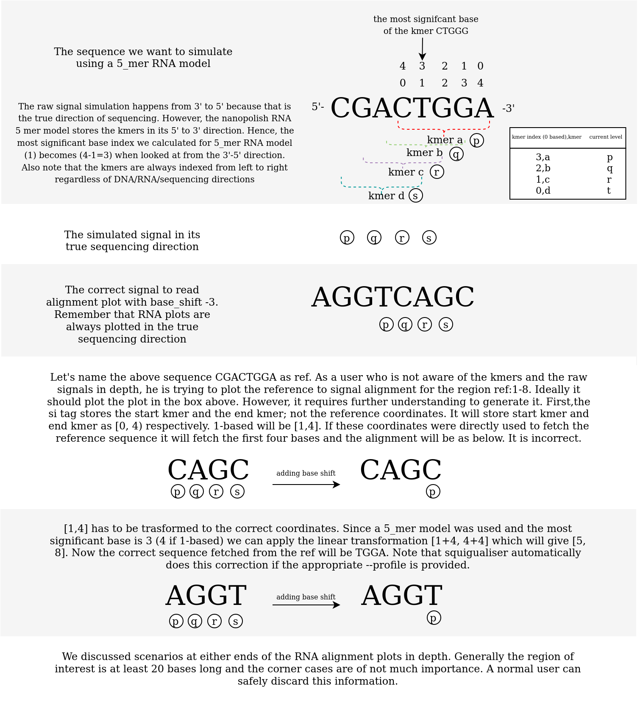
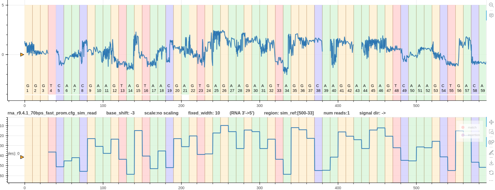

# Real vs simulated signal

We observed that for different chemistry the simulated signal and the real signal do not align right off the bat. 
This is expected as the simulated signal only has `n - k + 1` number of bases (signal levels). 
`n` is the number of bases in the original read.
`k` is kmer length of the model used to simulate the read.
To align it to the real signal a base shift must be used as discussed in [pore_model document](pore_model.md).

Consider the following example.

*Figure 1: A real r10 DNA signal vs its simulated signal*

In the above Figure, two things can be noted.
1. Simulated signal has 8 bases less than the real signal.
2. The two signals don't align each other.

The pore model used for the simulation is a 9_mer model (`n=50, k=9`). Hence, the simulated signal length is `50-9+1=42` bases.
The appropriate base shift is `-6` as discussed for r10 DNA chemistry ([pore_model document](pore_model.md)).
The real signal does not require a base shift (`--base_shift 0`). The reason for that discussed in [finding the correct kmer_length and sig_move_offset](calculate_kmer_length_sig_move_offset.md)

Following is a base shift corrected plot. It is expected to lose the last 6 current levels once this correction is performed. Ideally, the last 6 current levels be drawn by adding the next six bases to the simulated signal. 
However, the `paf` or `sam` alignment output generated by squigulator has the alignment region to be `42` bases as explained above.

*Figure 1: A real r10 DNA signal vs its simulated signal (base shift -6)*

## RNA example
The figure below illustrates the subtleties of RNA signal simulation and the subsequent read/ref signal alignment plot.

*Figure 2: An illustration of how the RNA signals are simulated and aligned*

Let's say you want to simulate the RNA transcript region `R1_92_1:500-999` (region length is 500) from the transcriptome 'test/data/raw/plot/reference_genomes/rnasequin_sequences_2.4.fa'.
For simulation, we use `rna-r9-prom` profile and the inbuilt `rna_r9.4.1_70bps_5_mer` model in `squigulator` which will create a `rna_r9.4.1_70bps` read that is `500-5+1=496` long in terms of kmers.
Note that the output sam file created by `squigulator` will have the `si:Z:0,21328,496,0`. More information on `si` tag can be found [here](https://github.com/hasindu2008/squigulator/blob/main/docs/output.md).
Also note that `squigualiser` always plot the RNA reads in its correct sequencing direction (reverse mapped RNA reads are skipped).

*Figure 3: The first track is a real `rna_r9.4.1_70bps` signal that maps to the regin `R1_92_1:999-500`.
It has zero base shift as it was reformed and realigned using the correct `--profile guppy_rna_r9.4.1_70bps_fast_prom` argument.
The second track shows the signal simulated using `squigulator` with `rna-r9-prom` profile.
In this case the argument `--profile kmer_model_rna_r9.4.1_70bps_5_mer` was provided to the `plot_pileup` tool. 
Hence, its base shift is `-3` and it nicely aligns not only with the most significant base index but also with the real signal above.*

This plot was generated using the pipeline is available for `rna_r9.4.1_70bps` data at `test/data/raw/pipelines/pipeline_0/rna_r9.4.1_70bps`.
