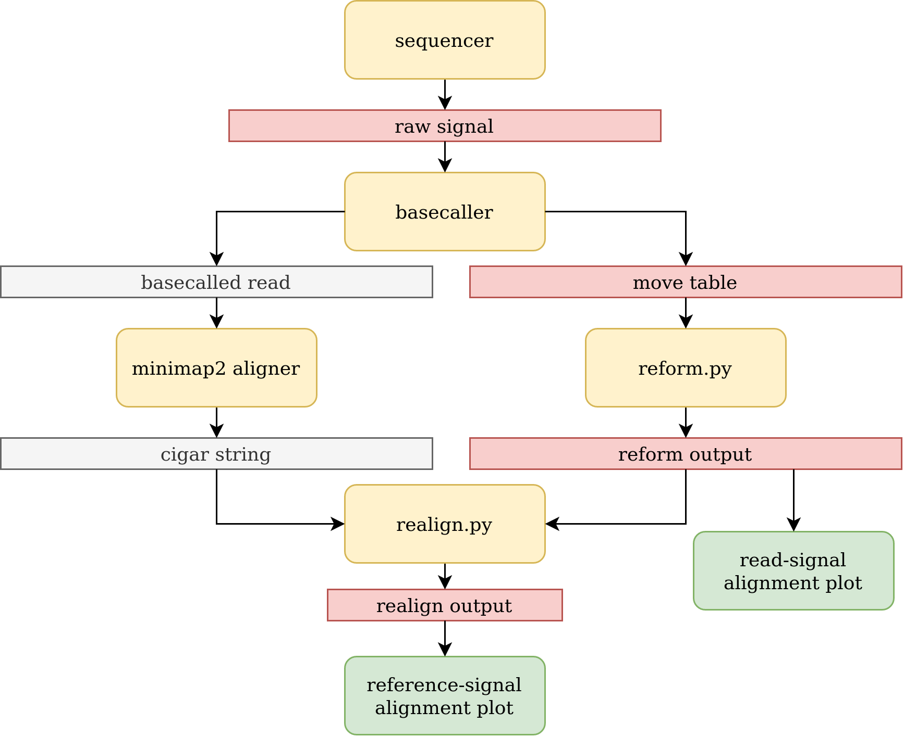

# Realign

`Realign` will realign the raw signal to the reference genome using the basecalled read's cigar string and the `reform` [output](reform.md).

In realign step cigar string and the reformed array is iterated from start to end in parallel. In this process the following processing is done to the reformed array.
1. The corresponding moves for the soft clipped bases in the cigar string will be clipped from the reformed array.
2. An insertion to the reference ('I' in CIGAR string) means a corresponding base is not present in the reference but a move is present in the reformed array (because the reformed array is from the basecalled read). Hence, we add an 'I' operator to the reformed array.
3. A deletion to the reference ('D' in CIGAR string) means a corresponding move is not present in the reformed array (because the move array is from the basecalled read). Hence, we add a 'D' operator to the reformed array.

## Note
1. Refer [here](https://hasindu2008.github.io/f5c/docs/output#ss-tag) for information about 'D/I' operators.
2. Refer [here](https://samtools.github.io/hts-specs/SAMv1.pdf) for SAM format and cigar string specification.
3. As shown in the figure above, the realign output is shorter than the reform output. That is mainly due to the removing the soft clipped moves from the reformed array.
